[TOC]


# linux基础操作

## 软件安装

每次安装软件前的命令：sudo apt-get update

安装软件的命令：sudo apt-get install xxxx

删除软件的命令：sudo apt-get remove xxxx

## 安装ssh服务器（远程终端）

### 安装软件包

让window（其他系统用户也可以）用户可以远程访问 ubuntu的命令行

```
sudo apt-get install openssh-server
```

### 连接终端

使用MobaXterm远程连接ubuntu的终端【只能在终端中写入命令】

- ==需要先在MobaXterm中建立ssh，其中的ip地址可在ubuntu中使用命令 ifconfig来查看==，随后只需要输入ubuntu的用户名和密码即可连接

## 远程目录（远程目录）

如果想要将源码放入或者取出，即远程目录

需要安装**samba服务器**

### 安装软件包

让window（其他系统用户也可以）用户可以远程访问 ubuntu的目录结构【==虽然可以让其他用户访问目录，但是需要配置限制用户可访问目录==】

```
sudo apt-get install samba
```

### samba的配置文件smb.conf

**gedit**:指以记事本的形式打开文件

```
sudo gedit /etc/samba/smb.conf
```

在文件末尾添加以下代码

```
[edu]
comment = samba home directory
path = /home/edu
public = yes
browseable = yes
public = yes
read only = no
valid users = edu
create mask = 0777
directory mask = 0777
force user = edu
force group = edu
available = yes
```

- 其中edu为用户名；
- ==path = /home/edu 中path=后面的路径为共享的目录==
- 0777代表权限，可读可写可执行

### 重启samba服务器

```
sudo /etc/init.d/samba restart
或者
sudo service smbd restart
```

### 设置访问 samba 目录的密码

```
sudo smbpasswd -a edu
```

### windows访问 samba 目录

windows 访问 ubuntu 的 samba 服务器(windows 访问 ubuntu 的目录

- 在 windows 中 win+r

- **==在弹出框中输入\ \\ +ubuntu的ip==**

点击确认后输入设置的samba用户名，密码后进入共享目录


# linux基础命令

**mkdir**:可使用mkdir来创建==**文件夹**== 如 mkdir tools或者一次创建多个文件夹mkdir tools work

**touch**：创建文件

**ls**:查看当前文件夹下的文件

### linux的目录结构

home目录下会根据创建的用户的用户名来创建一个文件夹，如在ubuntu中创建edu用户后，会在home目录下有一个edu目录

### 命令的格式

命令的格式：**命令 选项 参数**    【==选项和参数有时候可以没有==】

命令：就是命令名 

选项：一般以  **==-==**   开头 比如：-a -p -r 等 扩展命令的功能。

参数：描述命令的目标

### 常用命令

#### --help 命令的帮助信息  

需要查看的命令 --help

```
比如
ls --help
```

#### man 查看命令、库函数、系统调用的帮助信息 

man 是以章节的方式 管理命令、库函数、系统调用

- 第 1 章节 默认是命令 
- 第 2 章节 是系统调用 
- 第 3 章节 是库函数

如：

```
man 1 ls 从第 1 章节中查找 ls 命令
man 2 open 从第 2 章节查找系统调用函数 open
man 3 strcpy 从第 3 章节中查找库函数 strcpy
如果省略章节 默认为第 1 章节：比如 man ls
```

#### 重定向命令 > 与 >>

**echo**:类似与c中print，即打印数据至控制台中

**cat**:查看文件内容

如

```
echo hello  //将hello打印至控制台中
而使用重定向 > 后
echo hello > a.txt
//本来应该打印到控制台中的hello被写入到了a.txt
```

**注**：

- ==> 会覆盖掉源文件==.
- 而 ==>>== 是往文件末尾追加

```
echo "hello world" >> a.txt 将本应该显示到终端上的字符串 输入到 a.txt 文件中 >> 在文件末尾追加一行输入
```

#### 管道命令 | 

管道符左边命令执行的结果，会被右端的命令读走

例如

**ps -A**   : 将所有的进程信息 显示到终端上
**grep** :  查找命令,grep hehe 从终端的输入中查找 hehe，当输入的结果中有hehe时会高亮

```
那么此时
ps -A | grep ssh   
相当于grep命令将会读取ps -A执行的结果，并从中查找ssh
```

#### 查看当前目录下文件信息 ls

**ls**:查看当前目录下文件信息 

**ls -a**:显示所有文件（**包括隐藏文件**）

**ls -a -l**:以**显示所有文件**显示所有文件

**ls -a -l -h**: **-l -h需要配合**使用将会将文件大小以**合适的单位显示**。

注意：-a  -l  - h 没有顺序，不需要安装顺序书写

#### 树状显示目录文件信息

==默认 ubuntu 不支持 tree==

需要安装 **tree**

```
sudo apt-get update
sudo apt-get install tree
```

#### cd 切换目录的命令

- **cd ..** : 返回上一级 
- **cd ~** : 进入家目录 
- **cd**    : 进入家目录 
- **cd -**  : 进入上一次目录

#### pwd 显示你的位置

打印当前所处路径

#### rm 删除

**rm xxx** : 删除指定文件

**rm *.txt** : 删除以txt结尾的所有文件

**rm xxx -r** :  删除指定文件夹 

**rm xxx -f** : 强制删除文件

**rm *** : 删除所有文件

**rm * -r** :删除所有文件包括文件夹

**rm /xxx/xxx -rf** : 递归地删除 目录及其内容

#### cp 文件或目录的拷贝

##### cp文件

格式：**cp 源文件 目的目录**

```
cp file fileS  //将file文件复制一份到files下
```

#####  cp目录

格式：**cp 目录 目的目录 -r** 

```
cp fileS1 fileS2  //将fileS1文件夹复制一份到files下
```

##### 备份

```
cp a.txt b.txt //如果a.txt需要备份，可以直接使用cp来备份一份（另存为）名为b.txt的文件

```

cp 源目录 目的目录 【==**如果目的目录存在 就是将源目录拷贝到目的目录下，不存在则是备份**==】

#### mv剪切

格式：**mv 源文件 目的目录**

```
mv file fileS  //将file文件剪切一份到files下
```

文件夹同理【==**mv不需要加-r**==】


**重命名【文件名不存在】**：mv 源文件 文件名

**覆盖【文件名不存在】**：mv 源文件 文件名

#### mkdir 创建文件夹

```
mkdir xxx
mkdir a/b/c   //在a文件夹下的b文件夹下创建c文件夹
mkdir a/b/c -p  //如果路径中某个文件夹不存在则创建一个
```

#### touch 创建文件

```c++
touch xxx
```


#### find 查找文件

用法：**find 路径 -name 文件名**

即在**给定路径下遍历出所有文件名为给定文件名的路径**

#### grep 查找内容的命令

grep 默认是从 终端输入的内容中查找指定的内容

==**从指定的文件中 查找内容**==:

**grep 查找信息 文件名 参数-n 显示行号**

```
grep hehe a.txt -n  //加上-n就会显示行号
```

==**从指定的文件夹中 查找内容**==:

```
grep hehe /home -R -n  //加上-n就会显示行号
```

注意：**必须加上-R才会递归查找子目录**

#### 修改权限

```makefile
chmod +x 脚本文件名
```

#### <span style='color:red'>ln链接文件</span>

**软连接**：

- **ln 源文件名 链接文件名 -s**

- <span style='color:red'>链接文件 是源文件的快捷方式 二者内容时刻同步 如果删除源文件 快捷方式 无法使用</span>.

**硬连接**：

- ln 源文件名 链接文件名.、
- <span style='color:red'>源文件和链接文件 都是独立的文件 二者内容时刻同步 删除源文件 不影响链接 文件</span>。

#### tar 压缩和解压  

tar 是一个打包的命令 需要 **加上** **选项** 才能完成压缩或解压的功能。

##### gzip格式

**压缩命令**：tar zcvf 压缩包包名 文件 1 文件 2 ...

```
tar  zcvf ysb.tar.gz  work.txt hello.txt
```

**解压命令**: tar zxvf 压缩包的名字

```
tar zxvf ysb.tar.gz
```

**解压到指定文件命令**: tar zxvf 压缩包的名字 字 -C 指定的目录

```
tar zxvf ysb.tar.gz -C  ./text
```

##### bz2 格式

tar 是一个打包的命令 需要 **加上** **选项** 才能完成压缩或解压的功能。

##### gzip格式

**压缩命令**：tar jcvf 压缩包包名 文件 1 文件 2 ...

```
tar  jcvf ysb.tar.bz2  work.txt hello.txt
```

**解压命令**: tar jxvf 压缩包的名字

```
tar jxvf ysb.tar.bz2
```

**解压到指定文件命令**: tar jxvf 压缩包的名字 字 -C 指定的目录

```
tar jxvf ysb.tar.bz2 -C  ./text
```

##### 暴力解压

```
tar xvf 压缩包名
```

### vim-【~/tools】

gedit 是 linux 下文本编辑器。

#### 安装

```
sudo apt-get update
sudo apt-get install vim
sudo apt-get install ctags //用于补全
```

#### 配置

将vim_configure文件夹放入家目录下的tools文件夹中（没有则创建一个tools文件夹或者其他名字）

执行：

```
cd ~/tools/
cd vim_configure
sudo ./copy_con.sh
```

#### vim的三种模式以及切换

编辑模式：修改代码 复制、粘贴、剪贴、查找

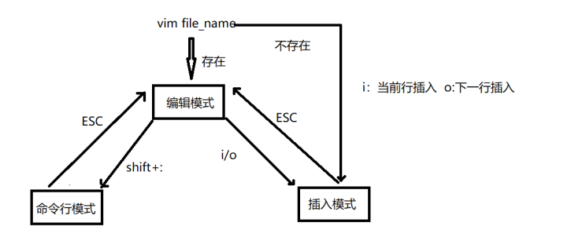

#### 编辑模式下的命令

<span style='color:red'>注意 </span> :  [n] 指的非固定数字，即可以是1，2，10等数字，在==编辑模式==下快速按下配合下列命令操作。

- u 撤消前面多次修改。 ctl r 反撤销
- [n]x 删除光标后 n 个字符。3x 表示删除光标后 3 个字符
- [n]X 删除光标前 n 个字符。3X 表示删除光标前 3 个字符
- [n]dd 删除从当前行开始的 n 行
- [n]yy 复制从当前行开始的 n 行。
- p 粘贴
- dw 删除一个单词
- yw 复制一个单词
- .  执行上一次操作
- shift +zz(按住 shift 按两下 z 键) 保存退出当前文件
- [n]G：将光标定位到第 n 行开始处
- G: 将光标定位到文件结束处
- gg:将光标定位到文件开始处
- / 字符串：从光标开始处向文件尾查找字符串。
  - n：同一方向重复上一次查找命令。
  - N：反方向重复上一次查找命令

- :nohls 取消高亮  【查找字符串后使用 shift+:切换至命令行】
- :set hls 设置高亮 vi 配置文件的作用 【查找字符串后使用 shift+:切换至命令行输入】

#### 命令行模式

- q 退出 
- w 保存 
- ！强制执行
- wq! 强制保存并退出
- w!强制保存不退出
- w 文件名 另存
- 打开多文件： vim a.c b.c c.c
- 切换某个文件:open c.c 切换到 c.c 中
- !linux 命令 等价在终端上运行

#### 编辑模式拓展命令

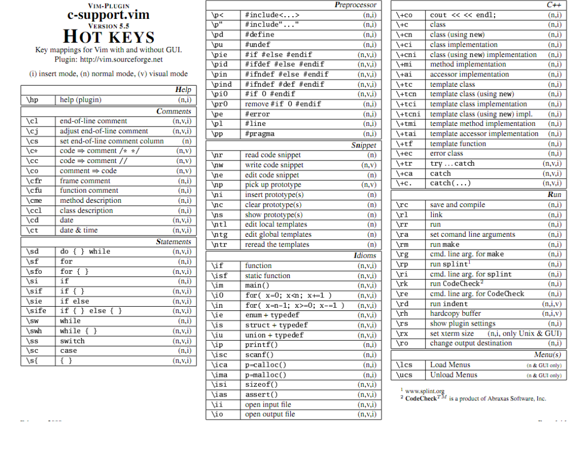

# Makefile

## 概述

- **make**  
  - make是一个命令 当用户输入make指令  系统自动寻找makefile、Makefile、 GNUmakefile 中任何一个，根据该文件中的指令编译工程。  
- **makefile** 
  -  makefile 是一个编译指令的脚本 里面纪录的是一条条编译方式  
- **采用 Makefile 的好处**  
  - 简化编译程序的时候输入得命令，编译的时候只需要敲 make 命令就可以了 
  - 因为会检查源文件是否改动，没有改动的话则会使用上一次生成的.out,而只重新编译改动过的文件。
  - 可以节省编译时间，提高编译效率。

## makefile的语法规则

```
目标：依赖文件列表
<Tab>命令列表 
```

- 目标文件： 依赖 "依赖文件列表"  
- 命令列表：具体将"依赖文件列表"生成"目标文件"的具 体指令 

用户在终端上输入make指令  自动寻找makefile 只会执行makefile中第一条"目标:依赖 文件列表" 

```
main:main.c fun.c 
【这里必须按下tab键】gcc main.c fun.c -o main
```

过程：

- 在项目文件下 创建 名为**==【makefile】==**或者==**【Makefile】**==的文件

- ```makefile
  test:test.c  link.c
  	gcc test.c link.c -o a.out
  //这里假设编译的主文件是test.c,函数库是link.c
  ```

- 在终端输入命令  make

### make 命令格式

- 输入make默认寻找makefile、Makefile、GNUmakefile中任何一个。

- make -f 用户指定的文件名  

  - ```
    //在终端输入
    make -f  【指定的makefile文件名】
    如：
    make -f  haha
    //此时则会按照该文件名去寻找makefile文件
    ```

- make 后跟其他目标  这样可以执行其他目标

  - ```makefile
    test:test.c  link.c
    	gcc test.c link.c -o test
    clean:      //后面没有依赖  此时 这个称为伪目标
        rm test
    ```

  - ```
    make clean
    //此时将会执行 rm test
    ```

### 复杂的make

```makefile
main:main.o fun.o 
	gcc main.o fun.o -o main 
main.o:main.c 
	gcc -c main.c -o main.o 
fun.o:fun.c 
	gcc -c fun.c -o fun.o 
clean: 
	rm main *.o
//当执行make命令时，
//先会准备执行 main，但是发现没有main.o，于是接着向下查找
//发现main.o会生成main.o文件，于是先执行main.o的命令
//而后  又发现没有fun.o ，于是接着向下查找
//发现fun.o会生成fun.o文件，于是接下来先执行fun.o的命令

//最终执行顺序
//gcc -c main.c -o main.o
//gcc -c fun.c -o fun.o 
//gcc main.o fun.o -o main 
```

## makefile的变量

### 自定义变量

- makefile 的变量名:  
  - makefile 变量名可以以数字开头  

- **注意**：
  -  变量是大小写敏感的  
  - 变量一般都在 makefile 的头部定义 
  -  变量几乎可在 makefile 的任何地方使用  

- 变量的定义格式【没有类型】：**变量名=变量值**  

- 如果需要==读取变量的值必须加上$符号==,并且变量名用（）包裹。

  - num=10   $(num)才是取变量的值

  - ```makefile
    GCC=gcc
    EXEC=test
    OBJ=test.c  link.c
    $(EXEC):$(OBJ)
    	$(GCC) test.c link.c -o $(EXEC)
    clean:
    	rm test
    ```

    

### 系统环境变量

#### 读取

make 工具会拷贝系统的环境变量并将其设置为 makefile 的变量，在 makefile 中可直接读取或修改拷贝后的变量。

即 ==有些变量名本身就存在于系统中，不需要定义可以直接使用==。

#### 导出

```
export 导出环境变量  
```

```
#export test=10  export 导出环境变量  
#make clean  
#echo $test

//此时在终端中 可以使用变量test
```

### 预定义变量 

makefile中有许多预定义变量，这些变量具有特殊的含义，可在makefile中直接使用。

- ==$@== ：目标名

- $< ：依赖文件列表中的第一个文件 

  - ```makefile
    GCC=gcc
    EXEC=test
    test.o:test.c
    	$(GCC) -c $< -o $@
    ```

- $^ ：依赖文件列表中除去重复文件的部分

  - ```makefile
    GCC=gcc
    EXEC=test
    $(EXEC):test.c  link.c
    	$(GCC) $^ -o $@
    //效果相当于$(GCC) test.c link.c -o $(EXEC)
    ```

- % :通配

- ```makefile
  test.o:test.c
  	gcc -c $< -o $@
  fun.o:fun.c
  	gcc -c $< -o $@
  //以上语句其实内容几乎相同，可使用%通配
  %.o:%.c
  	gcc -c $< -o $@
  ```

- AR 归档维护程序的程序名，默认值为 ar

- ARFLAGS 归档维护程序的选项

- AS 汇编程序的名称，默认值为 as

- ASFLAGS 汇编程序的选项

- CC C 编译器的名称，默认值为 cc 

- CFLAGS C 编译器的选项 

- CPP C 预编译器的名称，默认值为$(CC) -E

- CPPFLAGS C 预编译的选项

- CXX C++编译器的名称，默认值为 g++

- CXXFLAGS C++编译器的选项

完整例子：

```makefile
CC=gcc 
EXEC=main 
OBJ=main.o fun.o 
 
$(EXEC):$(OBJ) 
    $(CC) $^ -o $@ 
%.o:%.c 
    $(CC) -c $< -o $@ 
 
clean: 
    rm $(EXEC) $(OBJ) 
```

# shell

## shell概述

- shell本质是脚本文件：完成批处理。
- shell 是软件也是语言。
  - 软件：shell命令解析器：（sh、ash、bash），将脚本文件逐行解析执行。
  - 语言：shell脚本语言。必须复符合解析器的规则。

### 系统默认调用的两个脚本文件

- /etc/profile   ~/.bashrc
  - /etc/profile : 对系统的所有用户都有效   用户登录系统的时候 执行。
  - ~/.bashrc：对登录的用户有效    用户登录，打开终端。

### 写脚本的步骤

定义以开头:  #!   + 解释器     如  #!/bin/sh
==#!==  ：用来声明脚本由什么shell解释，否则使用默认shell

单个"#"号代表注释当前行

- 第一步

  - ```
    #!/bin/bash 指明脚本解析器用bash
    ```

- 第二步

  - 写脚本

- 第三步

  - ```
    在命令行中输入命令给脚本增加 可执行权限  【当权限不足时】
    格式：chmod +x 脚本文件名
    ```

- 第四步

  - ```
    执行脚本文件
     ./00_shell.sh 前者首先检测#!，使用#!指定的shell，如果没有使用默认的shell
     2 . 00_shell.sh 使用当前shell读取解释00_shell.sh
     3 bash 00_shell.sh 直接指定使用bash解释00_shell.sh
    ```

三种执行脚本的方式不同点:

- ./和l bash执行过程基本一致：
  - bash明确指定bash解释器去执行脚本，脚本中#指定的解释器不起作用
  - ./首先检测#!，使用#!指定的shell，如果没有使用默认的shell
- 用./和 bash去执行会在后台启动一个新的shell去执行脚本
- 用.去执行脚本不会启动新的shell,直接由当前的shell去解释执行脚本。

### 执行shell格式出错

方式一： 

```
sudo apt‐get install dos2unix
dos2unix  脚本文件名
```

方式二： 

需要用vim打开脚本，在最后一行模式下执行

```
:set ff=unix
```

## shell的变量

### shell的自定义变量

```shell
#!/bin/bash

#定义变量
num=10

#对变量读操作
echo $num

#对变量写操作
num=100
echo $num

#清除变量
unset num
echo "---$num"    这里会不打印任何值，只会打印---

```

### shell的变量获取键盘输入

```shell
num=0
#从键盘获取变量的值
-p"请输入两个的值:"意思是在读取之前先把字符串输入到终端

echo "请输入num的值:"
read num

read -p "请输入num的值:" num
echo "num = $num"

read -p "请输入两个的值:" num1 num2
echo "num1 = $num1,num2=$num2"
```

### 只读变量

```shell
readonly num=10

echo"num=$num"  //10

num=1000
echo "num=$num"  //10
```

### 脚本的变量导出为环境变量

可以直接使用系统的环境变量  【命令  env   可查看所有环境变量】

```shell
#直接使用系统的环境变量
echo"PWD=$PWD"

#将shell的变量导出为环境变量,这样其他脚本也可以使用
export num=1000
echo "num=$num"

//但是直接使用./运行 是导出不了的 需要使用source 【假设该脚本名为 test.sh】
source test.sh
```

### 清除环境变量【危险】

使用unset 命令清除环境变量

```makefile
unset  num   #清除了导出的环境变量 num
```


### 变量的注意事项

```makefile
# 1. 命名规则
#变量名由字母、数值、下划线组成 不能以数值开头  不能是关键字。


# 2. 变量使用时注意点
#等号两边不能直接接空格符
num = 100 #错误
num=100 #ok

#若变量中本身就包含了空格，则整个字符串都要用双引号、或单引号括起来
num=10 20 30 #错误
num="10 20 30" #ok
num='10 20 30' #ok

#双引号、或单引号的区别
num=100
echo "num1=$num"  #能解析变量      num1=100
echo 'num1=$num'  #不能解析变量     num1=$num

```

### 修改环境变量的值

环境变量名称一般是大写

```makefile
export NUM=10  #直接在命令行 声明一个环境变量

#但是修改时，很多变量都具有很很重要的数据，并不希望直接覆盖掉，而是追加
#因此可以拼接
export NUM=$NUM:20   #这样就追加了 20 给变量NUM 
```

### shell的预设变量

```makefile
$#：传给shell脚本参数的数量    # sh解析器才有效
$*：传给shell脚本参数的内容
$1、$2、$3、...、$9：运行脚本时传递给其的参数，用空格隔开
$?：命令执行后返回的状态
"$?"用于检查上一个命令执行是否正确(在Linux中，命令退出状态为0表示该命令正确执
行，任何非0值表示命令出错)。
$0：当前执行的进程名
$$：当前进程的进程号
"$$"变量最常见的用途是用作临时文件的名字以保证临时文件不会重复
```

```makefile
#命令行传参
./test.sh  10 20 


echo "第一个参数：$1"     # 10
echo "第二个参数：$2"     # 20

 # $?：命令执行后返回的结果或状态： 成功为0  失败为1
 echo "上条语句执行的结果:$?"     #  0
```

### shell脚本的特殊用法

- **""**（双引号）：包含的变量会被解释

- **'   '**（单引号）：包含的变量会当做字符串解释 

- **``** (数字键1左面的反引号)：反引号中的内容作为系统命令，并执行其内容，可以替换输出为 一个变量 

  - ```makefile
    #!/bin/bash
    echo "today is `date`"   #打印当前时间
    echo "today is `ls`"   #打印today以后执行  ls命令 显示文件夹文件
    ```

- **\\**  转义字符： 

  - 同c语言 \n \t \r \a等 

  - echo命令需加-e转义

  - ```makefile
    echo  -e "##\n##"
    ```

- **(命令序列)**：    由子shell来完成,不影响当前shell中的变量 

  - ```makefile
    num=10
    (
       num=100
       echo "（）中的num=$num" #不会影响外部变量的值  100
    )
    echo "()外的num=$num"   #  10
    ```

    

- **{ 命令序列 }**：    在当前shell中执行，会影响当前变量

  - ```makefile
    num=10
    {
       num=100
       echo "（）中的num=$num" #不会影响外部变量的值  100
    }
    echo "()外的num=$num"   #  100
    ```

    

## 条件测试

### 概述

- 语法1：使用关键字 test

  - ```makefile
    test condition
    ```

- 语法2:使用[] **==左右有空格==**.

  - ```makefile
    [ condition ]
    ```

### 文件状态的条件表达式 

文件测试：测试文件状态的条件表达式 

- -e 是否存在  
- -d  是目录   
- -f  是文件       
- -r  可读    
- -w 可写 
- -x  可执行
- -L  符号连接 
- -c 是否字符设备
- -b  是否块设备   
- -s  文件非空

```makefile
#!/bin/sh
test ‐e test.txt    #假设没有test.txt
echo "$?" #1 失败不存在

[ ‐e test.txt ]
echo "$?" #1 失败不存在

#假设创建了文件夹 a

test ‐e a
echo "$?" # 0 存在

[ ‐d a ]
echo "$?" #0 是文件夹

test ‐f a
echo "$?" #1 不是普通文件

[ ‐r a ]
echo "$?" #0 具备读权限
[ ‐w a ]
echo "$?" #0 具备写权限
[ ‐x a ]
echo "$?" #0 具备执行权限

test ‐s a.txt
echo "$?" # 1 空文件

test ‐s b.txt
echo "$?" # 0 非空文件
```

### 字符串测试

```makefile
str1=""
str2="hello"
test str_operator "str1" 
test "str1" str_operator "str2"
#  [ str_operator "str" ]
# [ "str1" str_operator "str2"]
其中str_operator可以是:
= 两个字符串相等   != 两个字符串不相等
z 空串            n 非空串

test z "$str1" 
test "$str1" = "$str2"
```

### 字符串的操作扩展

```makefile
!/bin/bash
str="hehe:haha:xixi:lala"

#测量字符串的长度${#str}
echo "str的长度为:${#str}"    #19

#从下标3为位置提取${str :3}
echo ${str: 3}           #"e:haha:xixi:lala"

#从下标为3的位置提取长度为6字节
echo ${str:3:6}        # "e:haha"

#${str/old/new}用新值new替换str中出现的第一个旧值old
echo $ {str/:/#}      # "hehe#haha:xixi:lala"

#${str//old/new}用新值new替换str中所有的旧值old
echo $ {str//:/#}   #"hehe#haha#xixi#lala"

```

### 数值计算

shell中进行数值运算  需要两个括号`(( ))`

```shell
#! /bin/bash
num=0
if [ ! -e  filearr ] || [ ! -d filearr  ];then
    `mkdir filearr `
fi


for i in `ls`
do
    if [ -f $i ];then
        num=$((num+1))
        `cp $i ./filearr`
    fi
done

echo $num
```

### 数值的测试

```
 test num1 num_operator num2    
[ num1 num_operator num2 ] 
```

num_operator可以是:   

-  -eq   数值相等     
-  -ne    数值不相等    
-  -gt     数1 大于 数2      
-  -ge    数1 大于等于 数2    
-  -le     数1 小于等于 数2    
-  -lt      数1 小于 数2

### 数值的扩展

```makefile
#$ {num:-val}如果num存在，整个表达式的值为num，否则为val
echo $ {num:-100}   #100
num=200
echo $ inum:-100}  #200_
```

```makefile
#$ {num: =val}
#如果num存在，整个表达式的值为num，
#否则为val，同时将num的值赋值为val
echo $ {num:=100}   #100
echo "num=$num"     #100

```

### 复合测试

&&： 

- command1 && command2 
- command1  执行成功 (即返回0）shell才执行  command2 

|| :

- command1 || command2
- command1 未执行成功(即返回非0）shell才执行  command2

多重判断：

| -a   | (and)两状况同时成立!<br/>test -r file -a -x file<br/>file同时具有r与x权限时，才为true. |
| ---- | ------------------------------------------------------------ |
| -o   | (or)两状况任何一个成立!<br/>test -r file -o -x file<br/>file具有r或x权限时，就传回true. |
| !    | 相反状态<br/>test !  -x file<br/>当file不具有x时，回传true.  |

## 控制与循环语句

### if控制语句

格式一：

```makefile
if [ 条件1 ]; then
	#执行第一段程序
else
	#执行第二段程序
fi
```

```makefile
#!/bin/bash
read ‐p "请输入一个文件名" fileName
if [ ‐e $fileName ];then     #文件是否存在
# ‐f $fileName 是否是文件   ‐s $fileName文件是否非空
	if [ ‐f $fileName ‐a ‐s $fileName ];then
		cat $fileName   #查看文件
	else
		echo "存在 但不是普通文件或者为空文件"
    fi
else
	# 文件不存在 创建文件
	touch $fileName
	echo "hello file" >> $fileName
	cat $fileName
fi
```

格式二

```makefile
if [ 条件1] ; then
	#执行第一段程序
elif [ 条件2 ];then
	#执行第二段程序
else
	#执行第三段程序
fi
```

### case控制语句

```makefile
case $变量名称 in
    "第一个变量内容")
       程序段一
       ;;
    "第二个变量内容")
       程序段二
       ;;
    *)
       其它程序段
       exit 1
  esac
```

```makefile
read -p "请输入你的选择（yes/no）: " yes
case $yes in
	y* | Y*)
		echo "yes"
		;;
    n*| N*)
        echo "no"
        ;;
    *)
        echo "选择其他"
        ;;
esac
```

### for循环语句

形式一：

- 初始值：变量在循环中的起始值 
- 限制值：当变量值在这个限制范围内时，就继续进行循环 
- 执行步阶：每作一次循环时，变量的变化量

```makefile
for (( 初始值; 限制值; 执行步阶 ))
do
	#程序段
done
```

```makefile
 # sum=0    系统会把 sum视作 字符串  0
 declare ‐i i=0
 declare ‐i sum=0 # declare ‐i 说明sum为整型 
 for (( i=0; i<=100; i++ ))
 do
 	#sum=$sum+$i
 	sum+=$i
 done
 echo "sum=$sum"
```

方式二

- break跳出循环 
- continue直接进入下一次循环

```makefile
for var in con1 con2 con3 ...
do
	#程序段
done

#第一次循环时，$var的内容为con1 
#第二次循环时，$var的内容为con2 
#第三次循环时，$var的内容为con3
```

```makefile
for i in 10 20 30 40 50
do
	echo "i=$i" 
done
```

```makefile
for fileName in `ls`
do
	if [ -d $fileName ];then
		echo "$fileName为文件夹"
	elif [ -f $fileName ];then
		case $fileName in
			*.sh)
				echo "$fileName为脚本文件"
		esac
	fi
done

```

### while循环语句

```makefile
while [ condition ]
do
	#程序段
done
```

```makefile
declare -i i=0
declare -i sum=0
while [ $i -le 100 ]
do
	sum+=$i
	i=$i+1
done
echo "sum=$sum"
```

### until

这种方式与while恰恰相反，当condition成立的时候退出循环，否则继续循环

```makefile
until [ condition ]
do
 #程序段
done
```

```makefile
declare -i i=0
declare -i sum=0
until [ $i -gt 100 ]
do
	sum+=$i
	i=$i+1
done
echo "sum=$sum"
```

## 函数

有些脚本段间互相重复，如果能只写一次代码块而在任何地方都能引用那就提高了代码的可 重用性。

 shell允许将一组命令集或语句形成一个可用块，这些块称为shell函数

```makefile
#格式一：
函数名()
 {               
   #命令...
 }
#格式二：
function 
函数名()
 { 
   #命令 ...
 }
```

### 案例:

封装一个函数计算两个数据的和

```makefile
declare -i a
#函数定义
function my_add(){
	# a=$1+$2
	a=`expr $1 + $2`
	return $a
}
read -p "请输入两个数值:" data1 data2

#函数调用
my_add $data1 $data2

# $?代表函数的返回值
echo"函数的返回值为$?"

```

### 函数分文件

source可引入其他文件内容

fun.sh

```makefile
function my_add(){
	# a=$1+$2
	a=`expr $1 + $2`
	return $a
}
```

test.sh

```makefile
source fun.sh
declare -i a

read -p "请输入两个数值:" data1 data2

#函数调用
my_add $data1 $data2

# $?代表函数的返回值
echo"函数的返回值为$?"
```

# 系统调用

## 概述

- 系统调用： 就是**内核 提供给用户可以操作内核的一组==函数接口==**。

- 用户借助系统调用 **操作内核**。
- 进程的空间分为：==内核空间== 和 ==用户空间==.
  - 它们逻辑上相互隔离，通常情况下用户空间无法访问内核空间和使用内核函数。
  - 用户进程需要获得系统服务（调用系统程序），必须利用系统提供的接口——系统调用。
  - 系统调用的特殊性主要在于规定了用户进程进入内核的具体位置。

- **系统调用详情**：
  - 系统调用是属于操作系统内核的一部分的，必须以某种方式提供给进程让它们去调用。
  - 操作系统有不同的运行级别，**用户态**和**内核态**。
    - 运行在内核态的进程可以毫无限制的访问各种资源，
    - 而在用户态下的用户进程的各种操作都有着限制，比如不能随意的访问内存、不能开闭中断以及切换运行的特权级别。
    - 属于内核的系统调用一定是运行在内核态下

- 
  如何**切换至内核**：
  - 软件中断。
  - 软件中断和我们常说的中断（硬件中断）不同之处在于，它是通过软件指令触发而并非外设引发的中断，也就是说，又是编程人员开发出的一种异常（该异常为正常的异常）。
  - 操作系统一般是通过软件中断从用户态切换到内核态

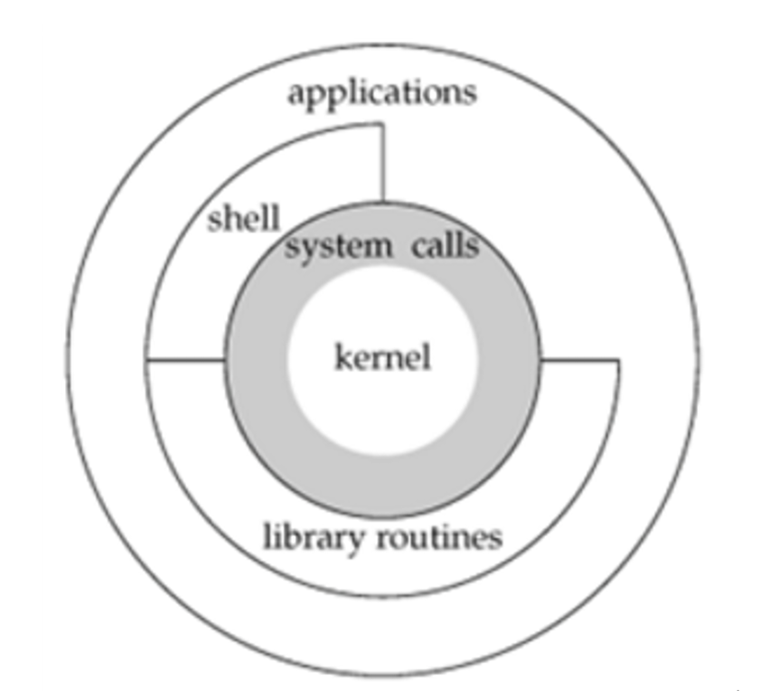

## 系统调用和库函数有啥区别

库函数由两类函数组成:

- 不需要调用系统调用
  - 不需要切换到内核空间即可完成函数全部功能，并且将结果反馈给应用程序，如strcpy、bzero 等字符串操作函数。
- 需要调用系统调用
  - 需要切换到内核空间，这类函数通过封装系统调用去实现相应功能，如 printf、fread等

- 系统调用 是内核提供的一组函数接口。内核提供 
- 库函数 是第三方的函数接口。 用户提供 
  - 如果库函数没有调用系统调用 ，该库函数就不能操作 内核 比如：字符串操作函数 strcpy， bzero 
  - 该库函数只有调用系统调用，该库函数才能操作 内核 比如：fopen fclose fwrite fgets

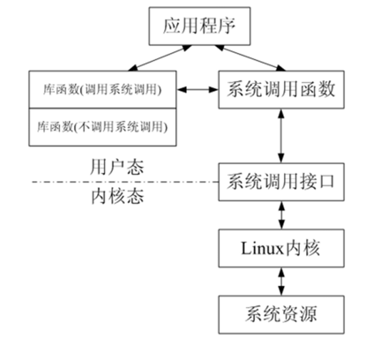

- 系统调用是需要时间的，程序中频繁的使用系统调用会降低程序的运行效率。
  - 当运行内核代码时，CPU工作在内核态，在系统调用发生前需要保存 用户态的栈 和 内存环境，然后转入内核态工作。
  - 系统调用结束后，又要切换回用户态。这种环境的切换会消耗掉许多时间。

## 文件描述符

Linux将系统调用 打开或新建的文件 **用 非负整数 来表示。而==这个 非负整数 就是 文件描述符==**。

- 打开现存文件或新建文件时，系统（内核）会返回一个文件描述符
- 文件描述符用来指定已打开的文件。
- 这个文件描述符相当于这个已打开文件的标号，文件描述符是非负整数是文件的标识，
- 操作这个文件描述符相当于操作这个描述符所指定的文件。-

**系统会为每一个进程 分配 文件描述符表**，管理该进程的所有文件描述符。 

系统会为 每一个进程 打开三个文件描述符：0,1,2 

- 0：标准输入设备（键盘） scanf 
- 1：标准输出设备（终端）printf 
- 2：标准错误输出 （终端）perror

### 文件描述符表是如何管理文件描述符的

- 文件描述符表 是通过 “位图” 来管理文件描述符。
- 使用1024位二进制位管理，位数代表 的就是文件描述符，位上的值1表示打开，值0表示关闭

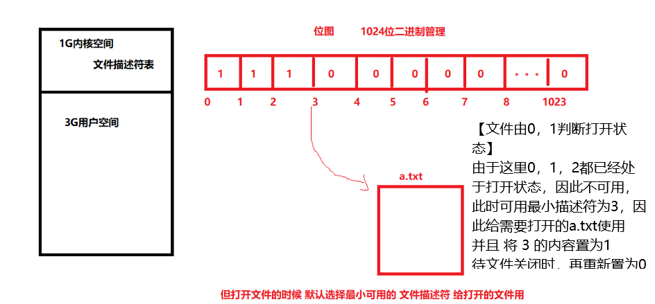

### 查看当前系统文件描述符最大数量

```makefile
ulimit -a
```

- 修改：ulimit -n 2048

  - ```
    ulimit -n 2048
    ```


## 文件IO的操作

文件常用操作IO: **open、close、read、write**。

### 打开文件 open

```c
#include <sys/types.h>
#include <sys/stat.h>
#include <fcntl.h>
//两个参数的open用于 打开已存在的文件
int open(const char *pathname, int flags);

//三个参数的open用于 打开不存在的文件，则创建， mode就是文件在磁盘上的权限
int open(const char *pathname, int flags, mode_t mode);
```

- 功能： 打开文件，如果文件不存在则可以选择创建。 

- 参数： 
  - pathname：文件的路径及文件名 
  - flags：打开文件的行为标志，必选项
    -  O_RDONLY, 
    - O_WRONLY, 
    - O_RDWR 
  - mode：这个参数，==**只有在文件不存在时有效，指新建文件时指定文件的磁盘权限**==。
- 返回值： 
  - 成功：成功返回打开的文件描述符 
  - 失败：-1

### flags 文件的操作权限（read write）

| 取值     | 含义                   |
| -------- | ---------------------- |
| O_RDONLY | 以只读的方式打开       |
| O_WRONLY | 以只写的方式打开       |
| O_RDWR   | 以可读、可写的方式打开 |

可选项，和 必选项 **按位或**起来

```c
O_RDONLY | O_CREAT
```

| 取值       | 含义                                                       |
| ---------- | ---------------------------------------------------------- |
| O_CREAT    | 文件不存在则创建文件，使用此选项时需使用mode说明文件的权限 |
| O_EXCL     | 如果同时指定了O_CREAT，且文件已经存在，则出错              |
| O_TRUNC    | 如果文件存在，则清空文件内容                               |
| O_APPEND   | 写文件时，数据添加到文件末尾                               |
| O_NONBLOCK | 对于设备文件, 以O_NONBLOCK方式打开可以  做非阻塞I/O        |

### mode文件在磁盘的用户权限

- 磁盘文件的用户权限分类：

  - 所有拥有者权限（u）

  - 同组用户权限 (g)

  - 其他用户权限 (o)

  - ```c
    -rwxrwxr-x   //权限
        其中 rwx 是所有者权限 可读可写可执行 相当于7 421
        其中 第二个 rwx 是同组用户权限
        其中 r-x  是其他用户权限
    ```

- 任何权限都分为：

  - 读（4）
  - 写（2）
  - 执行（1） 

- 这3个权限数值可以组合

  - 7--->可读可写可执行 
  - 6--->可读可写 
  - 5--->可读可执行 
  - 4--->只读

  - 3--->可写可执行  

  - 2--->只写  

  - 1--->可执行

### 权限描述符mode的权限表示

0xxx 每一个x都是（4,2,1）的组合


- 0777 所有者、同组用户、其他用户都是可读可写可执行 
- 0666 所有者、同组用户、其他用户都是可读可写 
- 0651 所有者可读可写 、同组用户可读可执行、其他用户可执行

### mode的系统掩码

查看掩码：umask

```
edu@edu:~/work/c/test$ umask
0002
```

- 文件的最终权限= 给定的权限 &  ( ~umask )

  - ```c
    int fd=open("text.txt",O_WRONLY | O_CREAT,0777); 
    //注意：这段代码只有当文件不存在 由该代码创建时 才会按照mode_t mode 0777来设置文件权限，而当文件本来就已经存在时，设置mode_t mode无效
    ```

  - ```c
    即 给定的权限  与上  umask的取反
    例如 umask 是0002   取反是1101
    给出权限 0111  与  1101 相与  得 0101  
    ```

- ==umask mode==：设置掩码，mode为八进制数 【危险】

- ==umask -S==：查看各组用户的默认操作权限


### close关闭文件描述符

```c++
#include <unistd.h>
int close(int fd);
```

- 功能： 关闭已打开的文件 
- 参数：
  - fd : 文件描述符，
  - open()的返回值 
- 返回值： 
  - 成功：0 
  - 失败： -1, 并设置errno 

close工作步骤:

1. 先将文件描述符的数量-1.
2. 当文件描述符的数量变为0的时候 .
3. 系统回收文件描述符所占的内核空间。

### 向文件写数据write

注意：write是从给出的首地址开始直接写入，而不是插入，会覆盖原本的内容

```c++
#include <unistd.h>
 ssize_t write(int fd, const void *buf, size_t count);
```

- 功能：   把指定数目的数据写到文件（fd） 
- 参数：   
  - fd : 文件描述符   
  - buf : 数据首地址  
  - count : 写入数据的长度（字节） 
- 返回值：   
  - 成功：实际写入数据的字节个数   
  - 失败： - 1

```c++
void main(int argc, char *argv[])
{

      int fd = open("text.txt", O_WRONLY | O_CREAT, 0777);
      if (fd < 0)
      {
            perror("open");
            return;
      }
      // 写入文件数据
      char buf[128] = "";
      fgets(buf, sizeof(buf), stdin);
      buf[strlen(buf) - 1] = 0;

      write(fd, buf, strlen(buf));
      close(fd);
}
```

### read读取文件数据

```c++
include <unistd.h>
ssize_t read(int fd, void *buf, size_t count);
```

- 功能： 把指定数目的数据读到内存（缓冲区）
- 参数：   
  - fd : 文件描述符  
  -  buf : 内存首地址   
  - count : 读取的字节个数 
- 返回值：   
  - 成功：实际读取到的字节个数、 <span style="color:red">**读完文件数据返回0**   </span>.  
  - 失败： - 1  

```c
void main(int argc, char *argv[])
{

    int fd = open("text.txt", O_WRONLY | O_CREAT, 0777);
    if (fd < 0)
    {
        perror("open");
        return;
    }
    // 读取文件数据
    char buf[128] = "";
    int len = read(fd, buf, sizeof(buf));
    printf("读取的内容%s, 长度:%d\n", buf, len);
    close(fd);
}
```

### lseek定位位置指针（读写位置）

```c
#include <unistd.h>
off_t lseek(int fd, off_t offset, int whence);
```

1. **fd**：
   - 这代表文件描述符，指定了要操作的文件。文件描述符是在打开文件时由系统返回的一个整数标识符，它允许程序引用特定的文件。
2. **offset**：
   - 偏移量是一个`off_t`类型的值，指定相对于`whence`的位置进行偏移。这个值可以是正数或负数，表示前移或后移多少字节。
3. **whence**：
   - `whence`决定了偏移量的基准位置，其值可以是`SEEK_SET`、`SEEK_CUR`或`SEEK_END`中的一个。`SEEK_SET`表示从文件起始位置开始偏移，`SEEK_CUR`表示从当前文件位置开始偏移，而`SEEK_END`则是从文件末尾位置开始偏移。

```c
#include <unistd.h>
#include <sys/types.h>
#include <stdio.h>

int main() {
    int fd;
    off_t offset;

    // 打开文件
    fd = open("example.txt", O_RDONLY);
    if (fd == -1) {
        perror("open");
        exit(1);
    }

    // 获取文件末尾位置
    offset = lseek(fd, 0, SEEK_END);
    if (offset == (off_t) -1) {
        perror("lseek");
        exit(1);
    }

    printf("The size of the file is: %jd bytes", (intmax_t)offset);

    // 关闭文件
    close(fd);

    return 0;
}
```


### 实现cp命令[案例]

```makefile
 cp b.txt test 将b.txt文件拷贝到test目录中
```

```c
void main(int argc, char *argv[])
{
      // argc代表参数个数 判断参数个数是否正确  如 (./a.out b.txt test)
      if (argc != 3)
      {
            printf("请输入三个参数");
      }
      //./a.out b.txt test  argv[0]相当于./a.out  argv[1]相当于b.txt,
      // 也就是保存了参数的首地址
      int fd_r = open(argv[1], O_RDONLY);
      if (fd_r < 0)
      {
            perror("open");
      }
      
      char file_name[32] = "";
      sprintf(file_name, "%s/%s", argv[2], argv[1]);
      int fd_w = open(file_name, O_WRONLY | O_CREAT, 0666);
      if (fd_w < 0)
      {
            perror("open");
      }

      // 不同的从fd_r中读取文件数据 写入fd_w文件中
      while (1)
      {
            unsigned char buf[128] = "";
            int len = read(fd_r, buf, sizeof(buf));
            if (len <= 0)
                  break;

            write(fd_w, buf, len);
            printf("len=%d\n", len);
      }

      // 关闭文件
      close(fd_r);
      close(fd_w);

      return 0;
}
```

## 文件的阻塞特性

- 阻塞和非阻塞 **针对的是文件描述符** 而不是read write函数 
- ==文件描述符 默认 为阻塞 的==。

### 通过open函数 在打开文件的时候 设置文件描述符为非阻塞

文件描述符 事先不存在 才使用open

```c
int fd=open("/dev/tty",O_RDONLY);
if(fd<0){
    perror("open");
    return;
}
printf("准备读取数据\n");
unsigned char buf[128]="";
read(fd,buf,sizeof(buf));  //默认阻塞,用户不输入数据 不继续执行
printf("读取到终端数据：%s\n",buf);
close(fd);
```

```c
int fd=open("/dev/tty",O_RDONLY | O_NONBLOCK);  
if(fd<0){
    perror("open");
    return;
}
printf("准备读取数据\n");
unsigned char buf[128]="";
read(fd,buf,sizeof(buf));  //使用 O_NONBLOCK 可选项后 不在阻塞 不等待用户输入
printf("读取到终端数据：%s\n",buf);
close(fd);
```

### 通过fcntl设置文件的阻塞特性

文件描述符 事先存在

```c
#include <unistd.h>
#include <fcntl.h>
int fcntl(int fd, int cmd, ... /* arg */ );
```

- 功能：改变已打开的文件性质，fcntl针对描述符提供控制。
- 参数： 
  - fd：操作的文件描述符 
  - cmd：操作方式 
  - arg：针对cmd的值，fcntl能够接受第三个参数int arg。 
- 返回值： 
  - 成功：返回某个其他值 
  - 失败：-1

**fcntl函数有5种功能**： 

- 复制一个现有的描述符（cmd=F_DUPFD） 
- 获得／设置文件描述符标记 (cmd=F_ GETFD或F_ SETFD) 
- 获得／设置文件状态标记  (cmd=F_ GETFL或F_ SETFL) 
- 获得／设置异步I/O所有权  (cmd=F_ GETOWN或F_ SETOWN) 
-  获得／设置记录锁  (cmd=F_ GETLK, F_ SETLK或F_SETLKW

### 设置一个存在的文件描述符的阻塞特性的步骤

- fcntl获取文件描述符的状态标记 
- 修改 获取到的 文件描述符的状态标记 
- 将修改后的状态标记 使用fcntl设置到文件描述符中

```c
//获取文件状态标记
int flag = fcntl(0,F_ GETFL);
//修改文件状态标记（具备非阻塞)
flag = flag | O_ NONBLOCK;
//设置让新的文件状态标记生效
fcntl(0,F_SETFL,flag);

printf("准备读取数据.......\n" );

unsigned char buf[ 128]= "";
read(0,buf, sizeof(buf));//不阻塞

printf("读到终端数据:%s\n", buf);

```

## 获取文件的状态信息

```c
#include <sys/types.h>
#include <sys/stat.h>
#include <unistd.h>
int stat(const char *path, struct stat *buf);
int lstat(const char *pathname, struct stat *buf);
```

- 功能： 
  - 获取文件状态信息 
  - **stat** 和 **lstat**的区别： 
    - 当文件是一个符号链接时，lstat返回的是该符号链接本身的信息；
    -  而stat返回的是该链接指向的文件的信息。 
- 参数： 
  - path：文件名 
  - buf：保存文件信息的结构体 
- 返回值： 
  - 成功： 0 
  - 失败: -1

### struct stat结构体说明

```c
struct stat {
    dev_t       st_dev;
    ino_t       st_ino;   //节点
    mode_t      st_mode;   //文件的类型和存取的权限
    nlink_t     st_nlink;  //连到该文件的硬连接数目，刚建立的文件值为1
    uid_t       st_uid;    //用户ID
    gid_t       st_gid;    //组ID
    dev_t       st_rdev;   //(设备类型)若此文件为设备文件，则为其设备编号
    off_t       st_size;   //文件字节数(文件大小)
    blksize_t   st_blksize; //块大小(文件系统的I/O 缓冲区大小)
    blkcnt_t    st_blocks;  //块数
    time_t      st_atime;   //最后一次访问时间
    time_t      st_mtime;   //最后一次修改时间
    time_t      st_ctime;   //最后一次改变时间(指属性)
};
```

**st_mode(16位整数)参数说明** 

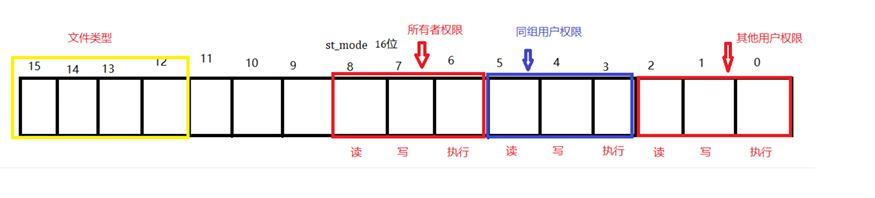

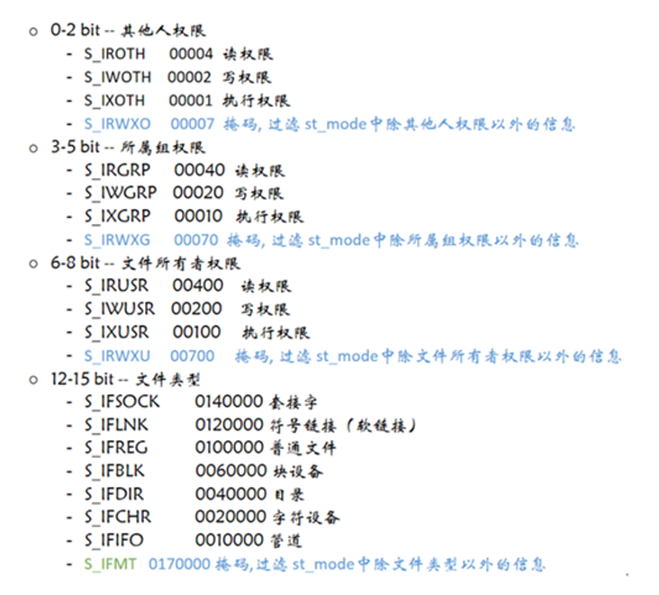

### 获取文件的属性、大小[案例]

```c
void test()
{
      // 获取文件的状态信息
      struct stat s;
      stat("b.txt", &s);
      // 分析文件类型（重要）
      if (S_ISREG(s.st_mode))  //是不是普通文件
      {
            printf("为普通文件\n");
      }else if (S_ISDIR(s.st_mode)) //是不是目录文件
      {
            printf("为目录文件\n");
      }

      // 获取文件的权限
      if ((s.st_mode & S_IRUSR) == S_IRUSR)  
          //文件类型与权限 与 所有者权限 相与 如果等于它本身 则具备这个权限
      {
            printf("所拥有者具备读权限\n");
      }

      if ((s.st_mode & S_IWUSR) == S_IWUSR)
      {
            printf("所拥有者具备写权限\n");
      }
      
      if ((s.st_mode & S_IXUSR) == S_IXUSR)
      {
            printf("所拥有者具备执行权限\n");
      }
}
```

## 文件目录操作

### 得到文件目录的句柄

句柄:就是结构体指针

```c
 #include <sys/types.h>
 #include <dirent.h>
  DIR *opendir(const char *name);
//  功能：打开一个目录
//  参数：
//    name：目录名
//  返回值：
//    成功：返回指向该目录结构体指针
//    失败：NULL
```

### 读取目录

```c
#include <dirent.h>
struct dirent *readdir(DIR *dirp);
```

- 功能：读取目录  ==**调用一次只能读取一个文件**==.
- 参数：   
  - dirp：opendir 的返回值 [句柄]
- 返回值：   
  - 成功：目录结构体指针   
  - 失败：NULL


```c
struct dirent
{
    ino_t  d_ino;                  // 此目录进入点的inode
    off_t  d_off;                    // 目录文件开头至此目录进入点的位移
    signed short int d_reclen;      // 该结构体变量的长度
    unsigned char    d_type;           // d_type 所指的文件类型  
    char             d_name[256];       // 文件名
};
```

d_type相关数据：

- DT_BLK：这是一个块设备。
- DT_CHR：这是一个字符设备
- DT_DIR： 目录
- DT_FIFO： 管道
- DT_LNK： 链接
- DT_REG： 普通文件
- DT_SOCK： 套接字

### 关闭目录

```c
#include <sys/types.h>
#include <dirent.h>
int closedir(DIR *dirp);
```

-  功能：关闭目录  
- 参数：    
  - dirp：opendir返回的指针 
-  返回值：    
  - 成功：0    
  - 失败：-1

```c
void test()
{
    DIR *dir = opendir("./");
    if (dir == NULL)
    {
        perror("opendir");
        return;
    }

    struct dirent *ret;
    while (ret = readdir(dir))
    {
        if ((ret->d_type & DT_REG) == DT_REG)
        {
            printf("文件名为%s\n文件大小%hd\n", ret->d_name, ret->d_reclen);
        }
        else if ((ret->d_type & DT_DIR) == DT_DIR)
        {
            printf("文件夹%s\n", ret->d_name);
        }
    }
    closedir(dir);
}
```

# 进程

## 概述

调度机制：时间片轮转、上下文切换

### 程序和进程的区别（重要）

- 程序：静态的 占磁盘空间 
- 进程：动态的 （调度、执行、消亡），占内存空间。（进程是程序执行到结束间的这个过程）

### 单道和多道程序设计

- 单道程序设计：所有进程一个一个排队执行。若A阻塞，B只能等待，即使CPU处于空闲状 态。
- 多道程序设计：在计算机内存中同时存放几道相互独立的程序，它们在管理程序控制之 下，相互穿插的运行

### 并行和并发的区别（重要）

并行和并发 **都是值多个任务同时执行**。 

并行(parallel)：指在同一时刻，有多条指令在多个处理器上同时执行。（多核）

并发(concurrency)：指在同一时刻只能有一条指令执行，但多个进程指令被快速的轮换执行，使得在宏观上具有多个进程同时执行的效果，但在微观上并不是同时执行的，只是把时间分成若干段，使多个进程快速交替的执行（单核）

### 进程控制块（PCB）

- 进程运行时，内核为每个进程分配一个PCB（进程控制块），维护进程相关的信 息，
- Linux内核的进程控制块是task_struct结构体。 
- PCB存在于进程的内核空间里面。
- 系统会为每一个进程分配一个进程ID，其类型为pid_t(非负整数) 
- 进程是**系统分配资源的基本单位**。

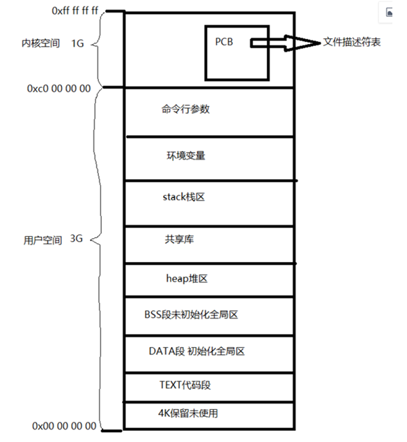

### 进程的状态

进程的状态：就绪态、执行态、等待态 

- 就绪态：执行条件全部满足，等待CPU的执行调度 
- 执行态：正在被CPU调度执行 
- 等待态：不具备CPU调度执行的执行条件，等待条件满足。

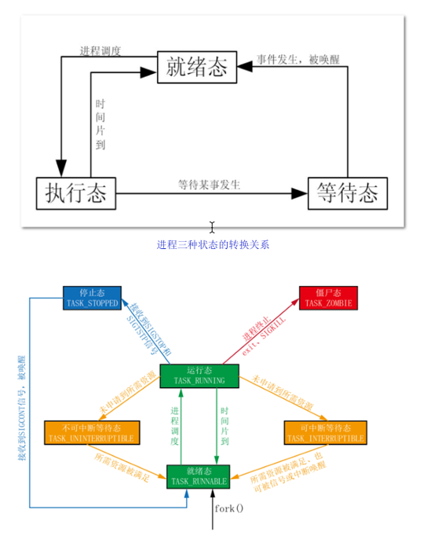

查看进程的状态：

```
ps -aux

ps -aux | grep bash  // 查看具体的进程
```

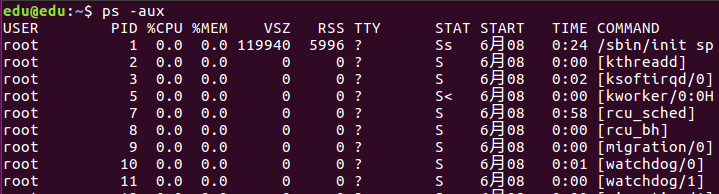

#### stat中的参数意义

| 参数 | 含义                                   |
| ---- | -------------------------------------- |
| D    | 不可中断 Uninterruptible（usually IO） |
| R    | 正在运行，或在队列中的进程             |
| S    | 处于休眠状态                           |
| T    | 停止或被追踪                           |
| Z    | 僵尸进程                               |
| W    | 进入内存交换（从内核2.6开始无效）      |
| X    | 死掉的进程                             |
| <    | 高优先级                               |
| N    | 低优先级                               |
| s    | 包含子进程                             |
| +    | 位于前台的进程组                       |

#### ps命令查看进程信息

| 选项 | 含义                                      |
| ---- | ----------------------------------------- |
| -A   | 显示终端上的所有进程，包括其他用户的进 程 |
| -u   | 显示进程的详细状态                        |
| -x   | 显示没有控制终端的进程                    |
| -w   | 显示加宽，以便显示更多的信息              |
| -r   | 只显示正在运行的进程                      |

#### 以树状显示进程：pstree

## 进程号PID

- 每个进程都由一个进程号来标识，其类型为 **pid_t（整型）**，**进程号的范围：0～32767**。
- 进程号总是唯一的，但进程号可以重用。
  - 当一个进程终止后，其进程号就可以再次使用. 
- 进程号（PID）： 标识进程的一个非负整型数 
- 父进程号（PPID）: 父进程号 
- 进程组号（PGID）： 进程组是一个或多个进程的集合。

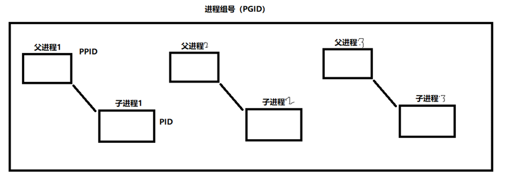

### 获取进程号的函数

```c
#include <sys/types.h>
#include <unistd.h>
pid_t getpid(void);
```

- 功能： 
  - 获取本进程号（PID） 
- 参数： 无 
- 返回值：
  -  本进程号

```c
void test()
{
  pid_t pid=getpid();
  printf("当前进程号%d\n",pid);   //当前进程号11130
}
```

### 获取父进程的ID

```c
#include <sys/types.h>
#include <unistd.h>
pid_t getppid(void);
```

- 功能： 
  - 获取调用此函数的进程的父进程号（PPID） 
- 参数： 无 
- 返回值： 
  - 调用此函数的进程的父进程号（PPID）

### 获取进程组的ID

```c
#include <sys/types.h>
#include <unistd.h>
pid_t getpgid(pid_t pid);
```

- 功能： 
  - 获取进程组号（PGID） 
- 参数： 
  - pid：进程号 
- 返回值： 
  - 参数为 0 时返回当前进程组号，否则返回参数指定的进程的进程组号

**注意**：

- **任何一个进程组中的进程号和当前组的组号 相等，那么这个进程就是这个进程组的组长进程**。
- 组长进程就是进程组中的第一个出现的进程
- 组长进程如果结束了，组号依旧不会改变

## 创建子进程【fork】

系统允许一个进程创建新进程，新进程即为子进程，子进程还可以创建新的子进程，形成 进程树结构模型

```c
#include <sys/types.h>
#include <unistd.h>
pid_t fork(void);
```

- 功能： 
  - 用于从一个已存在的进程中创建一个新进程，新进程称为子进程，原进程称为父进程。
- 参数： 无 
- 返回值： 
  - 成功：子进程中返回 0，父进程中返回子进程 ID。pid_t，为整型。 
  - 失败：返回-1。 
  - 失败的两个主要原因是： 
    - 当前的进程数已经达到了系统规定的上限，这时 errno 的值被设置为 EAGAIN。 
    - 系统内存不足，这时 errno 的值被设置为 ENOMEM

### fork出来的子进程和父进程之间的关系

- 使用fork函数得到的子进程是父进程的一个复制品，它**从父进程处继承了整个进程的地址空间**。
  - 地址空间: 包括进程上下文、进程堆栈、打开的文件描述符、信号控制设定、进程优先级、进程组号等
- **子进程所独有的只有它的进程号，计时器等**。
- 父子进程 从fork后开始继续执行。

```c
int test()
{
    pid_t pid = fork();
    if (pid < 0)
    {
        perror("创建失败");
        return 0;
    }

    else if (pid == 0)  
    { // 子进程将会执行的代码
        printf("子进程%d\n", getpid());
    }
    else if (pid > 0)
    { // 父进程将会执行的代码
        printf("父进程%d\n", getpid());
    }
    getchar();
    return 0;
}
```

**分析**：

1. 首先代码执行至 `pid_t pid = fork()`
2. 此时，产生了子进程，并且和父进程拥有了一模一样的代码
3. 在父进程中`pid_t pid = fork()`只关心子进程的pid，所以大于0，进而打印父进程
4. 而在子进程中，没有必要去获得父进程的pid，因为有getppid，所以使用0来表示自身是子进程，进而打印子进程

**注意**：

- 父子进程是同时运行，空间独立，子进程复制 父进程的所有空间，谁先运行不确定。

## 父子进程的关系

### 子进程复制父进程的资源但各自独立

```c
int test()
{
      pid_t pid = fork();
      int num = 10;
      if (pid < 0)
      {
            perror("创建失败");
            return 0;
      }

      else if (pid == 0)
      { // 子进程
            num = 100;
            printf("子进程%d,num=%d\n", getpid(), num);
      }
      else if (pid > 0)
      { // 父进程
            num = 200;
            printf("父进程%d,num=%d\n", getpid(), num);
      }
      getchar();
      return 0;
}
//打印结果
//父进程11820,num=200
//子进程11821,num=100
```

### 父子进程同时运行【应用场景】

```c++
//在下方例子中
//打印子进程、父进程字符串的功能，都是在死循环当中
//因此 打印子进程字符串的 代码 造成了阻塞，导致父进程字符串无法打印
//此时只有使用子进程来将它们分开，才不会造成阻塞而使得功能运行不全
//就是说当两个 功能原本会互相阻塞，而又希望可以同时运行时
//就可以使用子进程
int test()
{
    int num = 10;
    //此时需要打印子进程的字符串
        while (1)
        {
            printf("子进程ID:%d 中num=%d\n", getpid(), num);
            sleep(1);
        }

    //此时需要打印子进程的字符串
        while (1)
        {
            num = 200;
            printf("父进程%d,num=%d\n", getpid(), num);
        }
    getchar();
    return 0;
}
```

```c
int test()
{
    pid_t pid = fork();
    int num = 10;
    if (pid < 0)
    {
        perror("创建失败");
        return 0;
    }

    else if (pid == 0)
    { // 子进程
        while (1)
        {
            printf("子进程ID:%d 中num=%d\n", getpid(), num);
            sleep(1);
        }
    }
    else if (pid > 0)
    { // 父进程
        while (1)
        {
            num = 200;
            printf("父进程%d,num=%d\n", getpid(), num);
        }
    }
    getchar();
    return 0;
}
```

## 特殊的进程

孤儿进程、僵尸进程、守护进程。

### 孤儿进程（无危害）

父进程先结束、子进程就是孤儿进程，会被1号进程接管（1号进程负责给子进程回收资 源）

### 僵尸进程（有害）

子进程结束，父进程没有回收子进程资源（PCB）,子进程就是僵尸进程。

### 守护进程

守护进程 是脱离终端的 孤儿进程。在后台运行。为特殊服务存在的。（一般用于服务器）

## 终止进程

### exit()

`exit` 函数的作用是终止当前程序的执行，并返回一个指定的退出码给操作系统

```c
#include <stdlib.h>
void exit(int status);
//status 参数是程序的退出状态码，通常情况下，0 表示程序正常结束，非零值表示程序出现了错误或异常情况。调用 exit 函数后，程序将立即终止执行，并返回 status 给操作系统。

//exit（0）：正常运行程序并退出程序；
//exit（1）：非正常运行导致退出程序；
```

- exit(0)表示程序正常退出；
- 除了0之外，其他参数均代表程序异常退出，如：exit(1),exit(-1)。
- exit(0)则是返回0。exit(0)表示程序正常退出，非0表示非正常退出

### _exit()

exit()函数在调用exit系统之前要检查文件的打开情况，把文件缓冲区的内容写回文件。

由于Linux标准函数中，“缓冲I/O”的操作，其特征即对应每一个打开的文件，在内存中都有一片缓冲区。每次读文件时，会连续读出若干条记录，在下次读文件时就可以直接从内存的缓冲区读取；

同样每次写文件的时候也仅仅是写入内存的缓冲区，等满足了一定的条件（如达到了一定数量或遇到特定字符等）,再将缓冲区中的内容一次性写入文件。这种技术大大增加了文件读写的速度。

如果用_exit()函数直接将进程关闭，缓冲区的数据将会丢失。

## 父进程回收子进程的资源

在每个进程退出的时候，内核释放该进程所有的资源、包括打开的文件、占用的内存等。

但是仍然为其保留一定的信息，这些信息主要指进程控制块PCB的信息（包括进程号、退 出状态、运行时间等）【也就是说，内核无法主动释放进程控制块PCB的信息】

父进程可以通过调用**wait或waitpid**得到它的退出状态同时彻底清除掉这个进程。

 **注意**：

- ==一次wait或waitpid调用只能清理一个子进程==，清理多个子进程应使用循环。
- wait、waitpid基本上都是在父进程调用

### wait函数

```c
#include <sys/types.h>
#include <sys/wait.h>
pid_t wait(int *status);

//不关心返回的状态值，直接使用
//wait(NULL);即可
```

- 功能：   
  - 等待任意一个子进程结束，如果任意一个子进程结束了，此函数会回收该子进程的资 源。 
- 参数：   
  - status : 进程退出时的状态信息。 
- 返回值：   
  - 成功：已经结束子进程的进程号   
  - 失败： -1

**注意**：

- wait会阻塞 
- 若调用进程没有子进程，该函数立即返回
-  子进程已经结束，该函数同样会立即返回，并且会回收那个早已结束进程的资源

**状态值**：

-  **WIFEXITED(status)**： 如果子进程是正常终止的，取出的字段值非零。
-  **WEXITSTATUS(status)** ：返回子进程的退出状态，退出状态保存在status变 量的8~16位

```c
int test()
{
    pid_t pid = fork();
    if (pid < 0)
    {
        perror("创建失败");
        return 0;
    }

    else if (pid == 0)
    { // 子进程
        int i = 5;
        for (i = 5; i > 0; i--)
        {
            printf("子进程ID:%d 剩余生命值%ds\n", getpid(), i);
            sleep(1);
        }

        printf("子进程ID:%d 退出了\n", getpid());
        //终止进程 并返回异常状态10
        _exit(10);
    }
    else if (pid > 0)
    { // 父进程
        printf("父进程ID:%d 等待子进程结束\n", getpid());
        int status = 0;
        pid_t pid = wait(&status);
        if (WIFEXITED(status)) // 子进程正常退出
        {
            // 输出状态值
            printf("子进程退出的状态值：%d\n", WEXITSTATUS(status));
        }
        printf("父进程ID:%d 等到子进程%d结束\n", getpid(), pid);
    }
    getchar();
    return 0;
}
```

### waitpid函数

waitpid常用于 等待多个子进程结束。

```c
#include <sys/types.h>
#include <sys/wait.h>
pid_t waitpid(pid_t pid, int *status, int options)
```

- 功能:   

  - 等待子进程终止，如果子进程终止了，此函数会回收子进程的资源。 

- 参数：   

  - pid : 参数 pid 的值有以下几种类型：    
    - pid > 0 等待进程 ID 等于 pid 的子进程。   
    - pid = 0 等待同一个进程组中的任何子进程，如果子进程已经加入了别的进程组， waitpid 不会等待它。    
    - pid = -1 等待任一子进程，此时 waitpid 和 wait 作用一样。    
    - pid < -1 等待指定进程组中的任何子进程，这个进程组的 ID 等于 给出pid 的绝对值。   

- status : 

  - 进程退出时的状态信息。和 wait() 用法一样。   

- options : 

  - options 提供了一些额外的选项来控制 waitpid()。       
    - **0**：同 wait()，阻塞父进程，等待子进程退出。       
    - **WNOHANG**：没有任何已经结束的子进程，则立即返回。       
    - **WUNTRACED**：如果子进程暂停了则此函数马上返回，并且不予以理会子进程的结束状态。（由于涉及到一些跟踪调试方面的知识，加之极少用到） 

- 返回值：  一共有 3 种情况

  - 当正常返回的时候，waitpid() 返回收集到的已经回收子进程的进程号；    

  - 如果设置了选项 WNOHANG，而且调用 waitpid() 

    - ```c
      //即使用了如下代码：
      pid_t pid = waitpid(‐1,NULL, WNOHANG);//不阻塞
      ```
      
    - 还有子进程在运行,且没有子进程退出，返回0； 
  
    - 父进程的所有子进程都已经退出了 返回-1； 
  
    - 返回>0表示等到一个子进程退出      
  
  - 如果调用中出错，则返回-1，这时 errno 会被设置成相应的值以指示错误所在， 如：当 pid 所对应的子进程不存在，或此进程存在，但不是调用进程的子进程，waitpid() 就会出错返回，这时 errno 被设置为 ECHILD

## 创建多个子进程

使用for循环创建多个子进程

问题：

- 在每一次循环中，子进程由于会继承父进程的代码，导致子进程会同样fork除了本次循环之后的子进程，导致额外创建了“孙进程”，
- 循环n次，产生2的n次方个进程，产生2的n次方 减一 个子进程

使用**子进程返回fork返回值为0** 防止创建孙进程

```c
#define N 3
int test()
{
      int i = 0;
      for (i = 0; i < N; i++)
      {
            pid_t pid = fork();
            if (pid == 0) // 防止子进程创建孙进程
                  break;
      }
      // 判断具体的子进程
      if (i == 0) // 子进程1
      {
            // 完成任务A
            int j = 5;
            for (; j > 0; j--)
            {
                  printf("子进程%d 剩余事件%ds\n", getpid(), j);
                  sleep(1);
            }
            _exit(-1);
      }
      else if (i == 1) // 子进程2
      {
            // 完成任务B
            int j = 3;
            for (; j > 0; j--)
            {
                  printf("子进程%d 剩余事件%ds\n", getpid(), j);
                  sleep(1);
            }
            _exit(-1);
      }
      else if (i == 2) // 子进程3
      {
            // 完成任务C
            int j = 8;
            for (; j > 0; j--)
            {
                  printf("子进程%d 剩余事件%ds\n", getpid(), j);
                  sleep(1);
            }
            _exit(-1);
      }
      else if (i == N) // 父进程
      {
            // 回收所有子进程的资源
            while (1)
            {
                  pid_t pid = waitpid(-1, NULL, WNOHANG); // 不阻塞
                  if (pid > 0)                            // 某个子进程退出了
                  {
                        printf("子进程%d退出了\n", pid);
                  }
                  else if (pid == 0) // 还有子进程在运行
                  {
                        continue;
                  }
                  else if (pid == -1) // 所有子进程都退出了
                  {
                        break;
                  }
            }
      }

      return 0;
}
```

## 终端

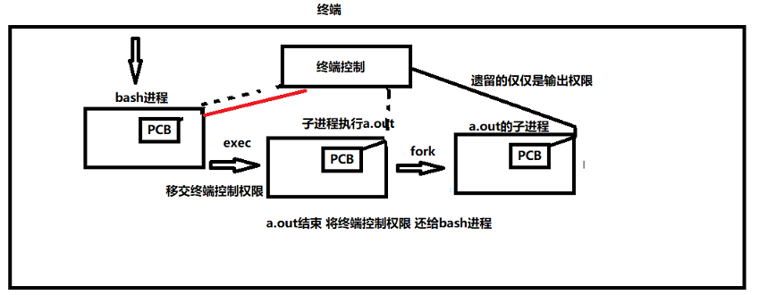


用户通过终端登录系统后得到一个Shell进程【当用户打开一个终端时，系统会开启一个进程】，

这个终端成为Shell进程的控制终端（Controlling Terminal），

进程中，控制终端是保存在PCB中的信息，而 fork会复制PCB中的信息，

因此由Shell进程启动的其它进程的控制终端也是这 个终端

```c
#include <unistd.h>
char *ttyname(int fd);
//功能：由文件描述符查出对应的文件名
//参数：
//   fd：文件描述符
//返回值：
//    成功：终端名
//    失败：NULL
```

## 进程组

- 多个进程的集合 
- 当父进程，创建子进程的时候，默认子进程与父进程属于同一进程组。

- 进程组ID为第一个进程ID(组长进程)： 

- 进程ID和进程组ID相同的进程就是 组长进程。 

- 可以使用==**kill -SIGKILL -进程组ID(负的)**==来将整个进程组内的进程全部杀死

  - ```c
    kill 进程PID  //杀死指定进程
    kill -9 进程PID  //发送强制终止信号，但请注意，这可能会导致未保存数据的丢失
        
    //-9这里属于信号的编号  具体 可见信号编号节，也可以直接写宏
    ```

- 只要进程组中有一个进程存在，进程组就存在，与组长进程是否终止无关

- 进程组生存 期：进程组创建到最后一个进程离开(终止或转移到另一个进程组)。

```c
pid_t getpgid(pid_t pid);
//功能：获取指定进程的进程组ID
//参数：
//  pid：进程号，如果pid = 0，那么该函数作用和getpgrp一样
//返回值：
//  成功：进程组ID
//  失败：-1
```


```c
int setpgid(pid_t pid, pid_t pgid)
//    功能：
//      改变进程默认所属的进程组。通常可用来加入一个现有的进程组或创建一个新进程组。
//    参数：
//       将参1对应的进程，加入参2对应的进程组中
//    返回值：
//       成功：0
//       失败：-1
```

## 杀死进程

```c
kill 进程PID  //杀死指定进程
kill -9 进程PID  //发送强制终止信号，但请注意，这可能会导致未保存数据的丢失
    
//-9这里属于信号的编号  具体 可见信号编号节，也可以直接写宏
```

## 会话

- 会话是一个或多个进程组的集合。 
- 一个会话可以有一个控制终端。
- 如果进程**ID=进程组ID=会话ID 那么该进程为会话首进程**。

### 创建会话的步骤

1. 调用进程不能是进程组组长，该进程变成新会话首进程(session header)
2. 该调用进程是组长进程，则出错返回
3.  该进程成为一个新进程组的组长进程
4. 需有root权限(ubuntu不需要)
5. 新会话丢弃原有的控制终端，该会话没有控制终端
6. 建立新会话时，先调用fork, 父进程终止，子进程调用setsid

```c
#include <unistd.h>
pid_t getsid(pid_t pid);
//功能：
//    获取进程所属的会话ID
//参数：
//    pid：进程号，pid为0表示查看当前进程session ID
//返回值：
//   成功：返回调用进程的会话ID
//   失败：-1
```

```c
 #include <unistd.h>
 pid_t setsid(void);

//功能：
//	创建一个会话，并以自己的ID设置进程组ID，同时也是新会话的ID。调用了setsid函数的进程，	既是新的会长，也是新的组长。
//参数：无
//返回值：
//	成功：返回调用进程的会话ID
//	失败：-1
```

创建一个会话:

```c
//此时子进程 新建了一个会话，并脱离了终端 
int test()
{
  pid_t pid=fork();
  if(pid>0){
      exit(1);
  }else if(pid==0){
      setsid();
  }

  while(1);

}
```

## 创建守护进程

1. **创建子进程，父进程退出(必须)** 所有工作在子进程中进行形式上脱离了控制终端

2. 在**子进程中创建新会话(必须)** setsid()函数 使子进程完全独立出来，脱离控制

3.  **改变当前目录为根目录(不是必须)** chdir()函数 防止占用可卸载的文件系统 也可以换成其 它路径

   1. ```
      定义函数：int chdir（const char * path）;
      函数说明：chdir（）用户将当前的工作目录改变成以参数路径所指的目录。
      返回值执行成功则返回0，失败返回-1，errno为错误代码。
      ```

4. **重设文件权限掩码(不是必须**) umask()函数 防止继承的文件创建屏蔽字拒绝某些权限 增 加守护进程灵活性

5.  **关闭文件描述符(不是必须)** 继承的打开文件不会用到，浪费系统资源，无法卸载

   1. ```c
      close(0);
      close(1);
      close(2);
      ```

6. 开始执行守护进程核心工作(必须) 守护进程退出处理程序模型

## vfork创建子进程

vfork函数：

- 创建一个新进程

- ```c
   pid_t vfork(void)   
  ```

功能：   

-  vfork函数和fork函数一样都是在已有的进程中创建一个新的进程，但它们创建的子进 程是有区别的。   
- ==**vfork创建的子进程 会保证子进程先运行，只有当子进程退出（调用 exec）的时候，父进程才运行**==。

返回值:    

- 创建子进程成功，则在子进程中返回0,父进程中返回子进程ID。出错则返回-1。

### vfork创建的子进程 和父进程 共用一个空间

```c
      int num = 0;
      pid_t pid = vfork();
      if (pid > 0)
      {
            printf("num=%d", num);  //100
      }
      else if (pid == 0) 
          //这里由于子进程先执行，且为num赋值100，因为vfork子进程 和父进程 共用一个空间，所以 父进程打印100
      {
            num = 100;
            _exit(-1);
      }
```

# exec函数族

exec函数族与一般的函数不同:

- exec函数族中的函数执行成功后不会返回。
- ==**只有调用失败了，它们才会返回-1**==。
  - 失败后从原程序的调用点接着往下执行。
  - 如果用到了exec函数族，要加错误判断语句。

**注意**：

- exec函数族取代调用进程的数据段、代码段和堆栈段。
- 也就是exec开辟的新进程 会将 原本进程 空间内容全部（包括代码）清除，只保留进程号。而自己则在原进程的空间接管原进程的内容
- 一个进程调用exec后，除了进程ID，进程还保留了下列特征不变： 父进程号 、进程组号、控制终端 、根目录 、当前工作目录 、进程信号屏蔽集 、未处理信号 ...

```c


//exec函数族：在进程中 启动另一个进程。
#include <unistd.h>
extern char **environ;
int execl(const char *path, const char *arg, .../* (char  *) NULL */);
int execlp(const char *file,const char *arg, ... /* (char  *) NULL */);
int execle(const char *path, const char *arg, .../*, (char *) NULL, char * const envp[] 
*/);
int execv(const char *path, char *const argv[]);
int execvp(const char *file, char *const argv[]);
int execvpe(const char *file, char *const argv[], char *const envp[]);
int execve(const char *filename, char *const argv[], char *const envp[]);
```

- 函数中有 **l (list)** 表明使用列表方式传参，

- 函数中有**v (vector) **表明使用指针数组传参。

- 函数中有 **p（path）** 表明 到系统环境中 找可执行性文件

-   函数中有 **e (evn)**  表明exec可以使用环境变量值

- avg表示选项数组

  - ```c
    char *avg[]={"ls","-a","-l","-h",NULL};
    execvp("/bin/ls",avg);
    ```

案例:

在代码中使用execl执行ls命令

```c
 execl(可执行文件位置,可执行文件名,可执行文件的选项,以NULL结尾);
which ls //查看命令位置
```

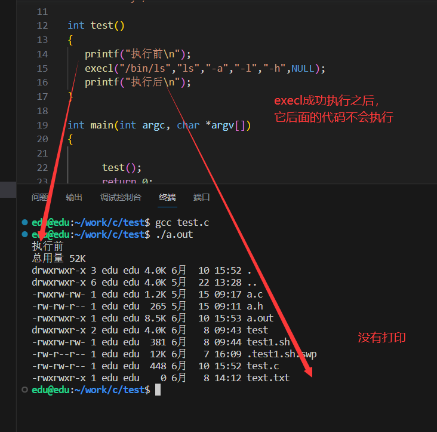

### vfork和exec配合使用

```c
int test()
{
      int num = 10;
      // vfork创建子进程
      pid_t pid = vfork();
      if (pid == 0) // 子进程
      {
            // 子进程负责启动起到程序
            sleep(3);
            //execlp 让子进程有了新的空间，使得不会再占用 父子共享的空间，使得父进程可以正常运行
            execlp("ls", "ls", "-a", "-l", "-h", NULL);

            // 显示退出
            _exit(-1);
      }
      else if (pid > 0) // 父进程
      {
            // 父进程运行自己的程序
            int i = 0;
            for (; i < 5; i++)
            {
                  printf("父进程%d中的i=%d\n", getpid(), i);
                  sleep(1);
            }
      }
      return 0;
}
```

# 信号

## 概述

信号的概念 信号是 Linux 进程间通信的最古老的方式。

信号是软件中断，它是在软件层次 上对中断机制的一种模拟，是一种异步通信的方式 。

信号可以导致一个正在运行的进程被 另一个正在运行的异步进程中断，转而处理某一个突发事件。

可以在用户空间进程间进行通信，也可以在内核空间和用户空间之间进行交互

**信号的特点**：

- 简单 
- 不能携带大量信息 
- 满足某个特设条件才发送

**完整的信号周期**：

- 信号的产生， 【这里信号的产生，注册，注销时信号的内部机制，而不是信号的函数实现】
- 信号在进程中的注册，
-  信号在进程中的注销， 
- 执行信号处理函数

**发起信号的方式**：

- a) 当用户按某些终端键时，将产生信号 
- b) 硬件异常将产生信号。 除数为 0，无效的内存访问等 
- c) 软件异常将产生信号（定时器） 
- d) 调用系统函数(如：kill、raise、abort)将发送信号 
- e) 运行 kill /killall命令将发送信号

## 信号的编号

其中1-31号信号称之为常规信号（也叫普通信号或标准信号），

34-64称之为==**实时信号**==，驱动编程与硬件相关。

而前32个名字各不相同

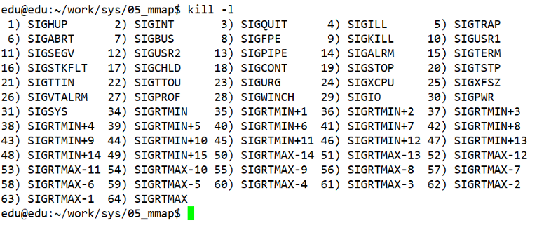

### Linux常规信号一览表

| 编号  | 信号                   | 对应事件                                                     | 默认动作                    |
| ----- | ---------------------- | ------------------------------------------------------------ | --------------------------- |
| 1     | SIGHUP                 | 用户退出shell时，由该shell启动的所有 进程将收到这个信号      | 终止进程                    |
| 2     | SIGINT                 | 当用户按下了键盘Ctrl+C组合键时，用户终端向正在运行中的由该终端启动的 程序发出此信号 | 终止进程                    |
| 3     | SIGQUIT                | 用户按下ctrl+\组合键时产生该信 号，用户终端向正在运行中的由该终端 启动的程序发出些信号 | 终止进程                    |
| 4     | SIGILL                 | CPU检测到某进程执行了非法指令                                | 终止进程并产生core文件      |
| 5     | SIGTRAP                | 该信号由断点指令或其他 trap指令产生                          | 终止进程并产生core文件      |
| 6     | SIGABRT                | 调用abort函数时产生该信号                                    | 终止进程并产生core文件      |
| 7     | SIGBUS                 | 非法访问内存地址，包括内存对齐出错                           | 终止进程并产生core文件      |
| 8     | SIGFPE                 | 在发生致命的运算错误时发出。不仅包 括浮点运算错误，还包括溢出及除数为 0等所有的算法错误 | 终止进程并产生core文件      |
| 9     | SIGKILL                | 无条件终止进程。本信号不能被忽略， 处理和阻塞                | 终止进程，可以杀死任何进 程 |
| 10    | SIGUSE1                | 用户定义的信号。即程序员可以在程序 中定义并使用该信号        | 终止进程                    |
| 11    | SIGSEGV                | 指示进程进行了无效内存访问(段错误)                           | 终止进程并产生core文件      |
| 12    | SIGUSR2                | 另外一个用户自定义信号，程序员可以 在程序中定义并使用该信号  | 终止进程                    |
| 13    | SIGPIPE                | Broken pipe向一个没有读端的管道写 数据                       | 终止进程                    |
| 14    | SIGALRM                | 定时器超时，超时的时间 由系统调用 alarm设置                  | 终止进程                    |
| 15    | SIGTERM                | 程序结束信号，与SIGKILL不同的是， 该信号可以被阻塞和终止。通常用来要 示程序正常退出。执行shell命令Kill 时，缺省产生这个信号 | 终止进程                    |
| 16    | SIGSTKFLT              | Linux早期版本出现的信号，现仍保留 向后兼容                   | 终止进程                    |
| 17    | SIGCHLD                | 子进程结束时，父进程会收到这个信号                           | 忽略这个信号                |
| 18    | SIGCONT                | 如果进程已停止，则使其继续运行                               | 继续/忽略                   |
| 19    | SIGSTOP                | 停止进程的执行。==信号不能被忽略==，处理会阻塞，             | 为终止进程                  |
| 20    | SIGTSTP                | 停止终端交互进程的运行。按下Ctrl+Z组合键时发出这个信号       | 暂停进程                    |
| 21    | SIGTTIN                | 后台进程读终端控制台                                         | 暂停进程                    |
| 22    | SIGTTOU                | 该信号类似于SIGTTIN，在后台进程要 向终端输出数据时发生       | 暂停进程                    |
| 23    | SIGURG                 | 套接字上有紧急数据时，向当前正在运 行的进程发出些信号，报告有紧急数据 到达。如网络带外数据到达 | 忽略该信号                  |
| 24    | SIGXCPU                | 进程执行时间超过了分配给该进程的 CPU时间 ，系统产生该信号并发送给该 进程 | 终止进程                    |
| 25    | SIGXFSZ                | 超过文件的最大长度设置                                       | 终止进程                    |
| 26    | SIGVTALR M             | 虚拟时钟超时时产生该信号。类似于 SIGALRM，但是该信号只计算该进程 占用CPU的使用时间 | 终止进程                    |
| 27    | SGIPROF                | 类似于SIGVTALRM，它不公包括该进 程占用CPU时间还包括执行系统调用时 间 | 终止进程                    |
| 28    | SIGWINC H              | 窗口变化大小时发出                                           | 忽略该信号                  |
| 29    | SIGIO                  | 此信号向进程指示发出了一个异步IO事 件                        | 忽略该信号                  |
| 30    | SIGPWR                 | 关机                                                         | 终止进程                    |
| 31    | SIGSYS                 | 无效的系统调用                                               | 终止进程并产生core文件      |
| 34~64 | SIGRTMI N ～ SIGRTMA X | LINUX的实时信号，它们没有固定的含 义（可以由用户自定义)      | 终止进程                    |

每个**信号必备4要素**，分别是:

- 编号
- 名称
- 事件
- 默认处理动作【 可通过man 7 signal 查看帮助文档】

## 未决信号集、信号阻塞集

未决信号集：信号发生 但未被处理的信号集合。（在PCB中） 

信号阻塞集：加入信号阻塞集的信号 不被处理。（在PCB中）

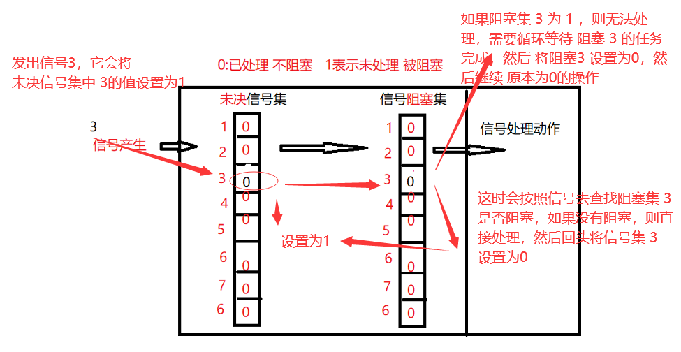

## 信号的API

### kill函数

```c
#include <sys/types.h>
#include <signal.h>
int kill(pid_t pid, int sig);
```

- 功能：给指定进程发送指定信号(不一定杀死) 
- 参数：    
  - pid: 
    - pid > 0: 将信号传送给进程 ID 为pid的进程。     
    - pid = 0 : 将信号传送给当前进程所在进程组中的所有进程。     
    - pid = -1 : 将信号传送给系统内所有的进程。     
    - pid < -1 : 将信号传给指定进程组的所有进程。这个进程组号等于 pid 的绝对值。   
  - sig : 信号的编号，这里可以填数字编号，也可以填信号的宏定义，可以通过命令==**kill - l("l" 为字母)**==进行相应查看。
    - 不推荐直接使用数字，应使用宏名，因为不同操作系统信号编号可能不同，但名称一致。 
- 返回值：   成功：0   失败：-1

### raise函数

```c
#include <signal.h>
 int raise(int sig);
```

- 功能：
  - 给当前进程发送指定信号(自己给自己发)，等价于 **kill(getpid(), sig)** 
- 参数： 
  - sig：信号编号 
- 返回值： 
  - 成功：0 
  - 失败：非0值

### abort函数

```c
#include <stdlib.h>
 void abort(void);
```

- 功能：
  - 给自己发送异常终止信号 6) SIGABRT，并产生core文件，等价于**kill(getpid(), SIGABRT)**; 
- 参数：无 返回值：
- 无


### alarm函数(闹钟)

```c
 #include <unistd.h>
 unsigned int alarm(unsigned int seconds);
```

- 功能： 
  - 设置定时器(闹钟)。在指定seconds后，内核会给当前进程发送**14）SIGALRM**【定时器超时】信号。进程收到该信号，默认动作终止。<span style="color:red">每个进程都有且只有唯一的一个定时器</span>。 取消定时器**alarm(0)**，返回旧闹钟余下秒数。 
- 参数： 
  - seconds：指定的时间，以秒为单位 
- 返回值： 返回0或剩余的秒数

定时，与进程状态无关(自然定时法)！就绪、运行、挂起(阻塞、暂停)、终止、僵尸……无论 进程处于何种状态，alarm都计时

```c
int test()
{
    int i = 0;
    printf("5秒后结束进程\n");
    // 定义一个5秒钟后超时的定时器
    // 此时由于该定时器之前没有定时器，s=0
    int s = alarm(5);
    printf("s=%d", s); // 0
    sleep(2);
    s = alarm(5);      // 重新定义定时器，因为之前定义了定时器，所以返回剩余时间
    printf("s=%d", 3); // 剩余三秒 所以 打印3

    return 0;
}
```

### setitimer函数（定时器）

```c
#include <sys/time.h>
int setitimer(int which, const struct itimerval *new_value, struct itimerval *old_value);
```

- 功能：   

  - 设置定时器(闹钟)。 可代替alarm函数。精度微秒us，可以实现周期定时。 

- 参数：  

  -  which：指定定时方式 
    - 自然定时：**ITIMER_REAL → 14）SIGALRM**计算自然时间     
    - 虚拟空间计时(用户空间)：**ITIMER_VIRTUAL → 26）SIGVTALRM** 只计算进程占 用cpu的时间     
    - 运行时计时(用户 + 内核)：**ITIMER_PROF → 27）SIGPROF**计算占用cpu及执行系 统调用的时间   
  - new_value ：struct itimerval, 负责设定timeout时间

  ```c
  struct itimerval {
      struct timerval it_interval; // 闹钟触发周期
      struct timerval it_value;    // 闹钟触发时间
  };
  
  struct timeval {
      long tv_sec;            // 秒
      long tv_usec;           // 微秒
  }
  
  //  itimerval.it_value： 设定第一次执行function所延迟的秒数 
  //  itimerval.it_interval：  设定以后每几秒执行function
  ```

-  old_value： 

  - 存放旧的timeout值，一般指定为NULL

- 返回值： 

  - 成功：0 
  - 失败：-1

```c
void fun(int sig)
{
      printf("触发信号sig=%d\n", sig);
}
int test()
{
      struct itimerval tv;
      // 过五秒发送一次超时信号
      tv.it_value.tv_sec = 5;
      tv.it_value.tv_usec = 0;

      // 每两秒发送一次超时信号
      tv.it_interval.tv_sec = 2;
      tv.it_interval.tv_usec = 0;

      //注册信号【相当于绑定事件】
      signal(SIGALRM, fun);

      setitimer(ITIMER_REAL, &tv, NULL); // 自然时间
      getchar();
      return 0;
}
```


## 给信号注册自定义函数

一个进程收到信号：执行默认动作、忽略信号、执行自定义动作。 

**注意**：SIGKILL 和 SIGSTOP 不能更改信号的处理方式，因为它们向用户提供了一种使 进程终止的可靠方法

### signal函数

```c
#include <signal.h>
typedef void(*sighandler_t)(int);
sighandler_t signal(int signum, sighandler_t handler);
```

功能：   

- 注册信号处理函数（不可用于 SIGKILL、SIGSTOP 信号），即确定收到信号后处理函数 的入口地址。此函数不会阻塞。 

参数：  

-  signum：信号的编号，这里可以填数字编号，也可以填信号的宏定义，可以通过命令 **kill - l("l" 为字母)**进行相应查看。   

- handler : 取值有 3 种情况：      

  - SIG_IGN：忽略该信号      

  - SIG_DFL：执行系统默认动作     

  - 信号处理函数名：自定义信号处理函数

    ```c
    //如：func      回调函数的定义如下： 
    void func(int signo)  
    { 
      // signo 为触发的信号，为 signal() 第一个参数的值     
    }
    ```

     

返回值：   

- 成功：第一次返回 NULL，下一次返回此信号上一次注册的信号处理函数的地址。如果 需要使用此返回值，必须在前面先声明此函数指针的类型。  

-  失败：返回 SIG_ERR

### sigaction函数

```c
#include <signal.h>
int sigaction(int signum, const struct sigaction *act, struct sigaction *oldact);
```

功能：   

- 检查或修改指定信号的设置（或同时执行这两种操作）。 

参数：   

- **signum**：要操作的信号。  
- **act**：  要设置的对信号的新处理方式（传入参数）。  
- **oldact**：原来对信号的处理方式（传出参数）。   如果 act 指针非空，则要改变指定信号的处理方式（设置），
- 如果 oldact 指针非空，则 系统将此前指定信号的处理方式存入 oldact。 

返回值：   

- 成功：0   
- 失败：-1

####  struct sigaction结构体

```c
struct sigaction {
    void(*sa_handler)(int); //旧的信号处理函数指针
    void(*sa_sigaction)(int, siginfo_t *, void *); //新的信号处理函数指针
    sigset_t   sa_mask;      //信号阻塞集
    int        sa_flags;     //信号处理的方式
    void(*sa_restorer)(void); //已弃用
};
```

- **sa_handler、sa_sigaction**：
  - 信号处理函数指针，和 signal() 里的函数指针用法一样，应根据情况给sa sigaction、sa handler 两者之一赋值，其取值如下：
    - SIG IGN：忽略该信号 
    - SIG DFL：执行系统默认动作 
    - 处理函数名：自定义信号处 理函数 
- **sa mask**：信号阻塞集，在信号处理函数执行过程中，临时屏蔽指定的信号。 
- **sa flags**：用于指定信号处理的行为，==通常设置为0==，表使用默认属性。它==可以是以下值 的“按位或”组合==： 
  -  **SA_ RESTART**：使被信号打断的系统调用自动重新发起（已经废弃）
  -  **SA_ NOCLDSTOP**：使父进程在它的子进程暂停或继续运行时不会收到 SIGCHLD 信 号。
  -   **SA_ NOCLDWAIT**：使父进程在它的子进程退出时不会收到 SIGCHLD 信号，这时子 进程如果退出也不会成为僵尸进程。 
  - **SA_ NODEFER**：使对信号的屏蔽无效，即在信号处理函数执行期间仍能发出这个信 号。 
  -  **SA_ RESETHAND**：信号处理之后重新设置为默认的处理方式。 
  -  **SA_ SIGINFO**：使用 sa sigaction 成员而不是 sa handler 作为信号处理函数。

#### 信号处理函数

```c
 void(*sa_sigaction)(int signum, siginfo_t *info, void *context)
```

参数说明：  

-  signum：信号的编号。   
- info：记录信号发送进程信息的结构体。   
- context：可以赋给指向 ucontext_t 类型的一个对象的指针，以引用在传递信号时被中 断的接收进程或线程的上下文

```c
void my_func(int sig)
{
      printf("ctrl+c被按下了\n");
}

int test()
{
      struct sigaction act;

      // act存放回调函数
      act.sa_handler = my_func;
      // act添加阻塞集 act.sa_mask
      // 清空阻塞集
      // sigemptyset(&act.sa_mask);

      // 将所有信号添加到阻塞集中
      sigfillset(&act.sa_mask);

      // SA_RESETHAND：信号处理之后重新设置为默认的处理方式
      act.sa_flags = 0; // 默认方式
      // act.sa_flags |= SA_RESETHAND;

      sigaction(SIGINT, &act, NULL);  // SIGINT 用户按下组合键信号

      while (1)
            ;
      return 0;
}
```

## 集合操作

### 信号集合的概述

在PCB中有两个非常重要的信号集。一个称之为“阻塞信号集”，另一个称之为“未决信号 集”。

 这两个信号集都是内核使用位图机制来实现的。

但操作系统不允许我们直接对其进 行位操作。

而需自定义另外一个集合，借助信号集操作函数来对PCB中的这两个信号集进行修改

### 自定义信号集函数

```c
sigset_t set  //set即一个信号集。
```

```c
#include <signal.h>  
int sigemptyset(sigset_t *set);       //将set集合置空
int sigfillset(sigset_t *set);         //将所有信号加入set集合
int sigaddset(sigset_t *set, int signo);  //将signo信号加入到set集合
int sigdelset(sigset_t *set, int signo);   //从set集合中移除signo信号
int sigismember(const sigset_t *set, int signo); //判断信号是否存在
```

```c
int test()
{
      // 定义一个信号集合
      sigset_t set;

      // 清空信号集合
      sigemptyset(&set);

      // 将SIGINT 加入set集合
      sigaddset(&set, SIGINT);
      // 将SIGISTP 加入set集合
      sigaddset(&set, SIGTSTP);

      // 判断SIGINT是否在set中
      if (sigismember(&set, SIGINT))
      {
            printf("SIGINT在set集合中\n");
      }

      return 0;
}
```


## 信号屏蔽集（阻塞集）

信号阻塞集也称信号屏蔽集、信号掩码。

每个进程都有一个阻塞集，创建子进程 时子进程将继承父进程的阻塞集。

所谓阻塞并不是禁止传送信号, 而是暂缓信号的传送

```c
#include <signal.h>
int sigprocmask(int how, const sigset_t *set, sigset_t *oldset);
```

- 功能：  
  -  检查或修改信号阻塞集，根据 how 指定的方法对进程的阻塞集合进行修改，新的信号阻 塞集由 set 指定，而原先的信号阻塞集合由 oldset 保存。 
- 参数：   
  - **how** : 信号阻塞集合的修改方法，有 3 种情况：     
    - **SIG_BLOCK**：向信号阻塞集合中==添加 set 信号集==，新的信号掩码是set和旧信号掩码 的并集。相当于 mask = mask|set。    
    -  **SIG_UNBLOCK**：从信号阻塞集合中==删除 set 信号集==，从当前信号掩码中去除 set 中 的信号。相当于 mask = mask & ~ set。    
    -  **SIG_SETMASK**：将信号阻塞集合==设为 set 信号集==，相当于原来信号阻塞集的内容清 空，然后按照 set 中的信号重新设置信号阻塞集。相当于mask = set。  
  -  **set** : 要操作的信号集地址。     若 set 为 NULL，则不改变信号阻塞集合，函数只把当前信号阻塞集合保存到 oldset 中。   
  - **oldset** : 保存原先信号阻塞集地址 
- 返回值：   
  - 成功：0，   
  - 失败：-1，失败时错误代码只可能是 EINVAL，表示参数 how 不合法

## 未决信号集

```c
#include <signal.h>
int sigpending(sigset_t *set);
```

- 功能：
  - 读取当前进程的未决信号集 
- 参数：  
  -  set：未决信号集 
- 返回值：  
  -  成功：0   
  - 失败：-1

```c
int test()
{
    // 定义一个信号集合
    sigset_t set;

    // 清空信号集合
    sigemptyset(&set);

    // 将SIGINT 加入set集合
    sigaddset(&set, SIGINT);

    // 将set集合添加到阻塞集中
    sigprocmask(SIG_BLOCK, &set, NULL);

    printf("5秒后判断SIGINT是否在未决信号集中\n");
    sleep(5);

    sigset_t set2;
    sigemptyset(&set2);
    sigpending(&set2);
    if (sigismember(&set2, SIGINT))
    {
        printf("SIGINT在未决信号集中\n");
    }

    // 将set集合从阻塞集删除
    sigprocmask(SIG_UNBLOCK, &set, NULL);
    getchar();
    return 0;
}
```

# 进程间通信方式（IPC)

进程间通信方式有7种通信方式：

- 无名管道、有名管道（命令管道）、消息队列、共享内存、信号、信号量、套接字

不同主机的进程通信：

- socket(网络通信)

**通信的特点**：

- **无名管道**：血缘关系、半双工、一对一、先进先出、无格式、数据读取后就丢弃（内存 中） 
- **有名管道**：无血缘、半双工、一对一、先进先出、无格式、数据读取后就丢弃（内存抽 象成文件名） 
- **消息队列**：多对多、按消息类型收取、同类型先进先出、有格式、数据读取后就丢弃 （内存中） 
- **mmap(存储映射):**多对多、无格式、数据读取后存在、写入覆盖以前数据（磁盘中） 
- **共享内存**：多对多、无格式、数据读取后存在、写入覆盖以前数据（物理内存）。共享内存是最快的IPC形式，因为它可以直接在内存中进行数据的读写，而不需要像其他方式那样通过系统调用或者复制数据
- **信号**：简单 不能携带大量信息 满足某个特设条件才发送 
- **信号量（信号灯）**：主要用于进程间的同步，它们可以控制多个进程对共享资源的访问
- **socket**:不同主机间的进程通信（网络通信）


# 管道、命令管道

## 文件描述符复制 dup\dup2

让新的文件描述符 指向 旧的文件描述符。（==新旧文件描述符指向同一个文件==） 使用的函数dup、dup2

### dup

```c
#include <unistd.h>
int dup(int oldfd);
//  dup函数的功能：从系统中寻找最小可用的文件描述符 作为     oldfd的副本。
//  新文件描述符 通过dup的返回值返回。
```


### dup2

```c
#include <unistd.h>
 int dup2(int oldfd, int newfd);
 //    dup2的功能：将newfd作为oldfd的副本。
 //    如果newfd事先存在  dup2会先close(newfd)，   		然后将newfd作为oldfd的副本。
//也就是oldfd，newfd将一起指向oldfd所指向的文件
```


## 无名管道

### 概述

管道(pipe)又称无名管道。

无名管道是一种特殊类型的文件，在应用层体现为 两个打开的文件描述符。

管道是最古老的.UNIX IPC方式.【IPC:进程兼通讯方式】


### 管道的特点

1. 半双工，数据在同一时刻只能在一个方向上流动。
2. <span style="color:red">数据只能从管道的**一端写入**，从**另一端读出**</span>。
3. 写入管道中的数据遵循**先入先出**的规则。
4. 管道所传送的数据是**无格式**的，这要求管道的读出方与写入方==**必须事先约定好数据 的格式**==，  如多少字节算一个消息等。 
5. 管道不是普通的文件,因此==没有文件描述符==，不属于某个文件系统，其**只存在于内存中**。
6. 管道在内存中对应一个缓冲区。不同的系统其大小不一定相同。
7. 从管道读数据是一次性操作，数据一旦被读走，它就从管道中被抛弃，释放空间以 便写更多的数据。
8. **管道没有名字**，**只能在具有血缘关系的进程之间使用**.

### 无名管道的创建

```c
#include <unistd.h>
int pipe(int filedes[2]);
```

- 功能：
  - 经由参数filedes返回两个文件描述符 

- 参数：
  -  filedes为int型数组的首地址，其存放了管道的文件描述符fd[0]、fd[1]。 
    - filedes[0]为读而打开，
    - filedes[1]为写而打开管道，filedes[0]的输出是filedes[1]的输 入。
-  返回值： 
  - 成功：返回 0 
  - 失败：返回-1 

**注意**：在使用无名管道的时候 必须事先确定，谁发，谁收的问题，因为只能指定一次，如果需要设置不同的收发对象，只能再创建一个管道。

```c
int test()
{
    int fd[2];
    pipe(fd);

    pid_t pid = fork();
    if (pid == 0)
    {
        // 这里子进程负责读，所以写端无意义，直接关闭
        close(fd[1]);
        printf("子进程%d 等待父进程数据\n", getpid());
        unsigned char buf[128] = "";
        read(fd[0], buf, sizeof(buf));
        printf("子进程%d 收到的数据%s\n", getpid(), buf);

        close(fd[0]);
        _exit(1);
    }
    else if (pid > 0)
    {
        // 这里父进程负责写，所以读端无意义，直接关闭
        close(fd[0]);
        printf("父进程%d 3s后写入数据\n", getpid());
        sleep(3);
        write(fd[1], "hello", strlen("hello"));
        printf("父进程%d 写入完成\n", getpid());
        // 写完成，关闭写端
        close(fd[1]);

        //等待子进程退出，回收
        wait(NULL);
    }
}
```

### 无名管道读写的特点

- 默认用read函数从管道中读数据是阻塞的【例如，上一节代码，子进程需要等待父进程的i消息】。 
- 调用write函数向管道里写数据，当缓冲区已满时write也会阻塞。
-  通信过程中，==**所有**==读端口【包括父进程的】全部关闭后，写进程向管道内写数据时，写进程会（收到SIGPIPE信号）退出。

### 无名管道综合案例

模拟`ps -A | grep bash` 相同功能

- 为了让第一个子进程将结果写入管道的写端，需要将标准输出（文件描述符为1）重定向到管道的写端，即`dup2(fd[1], 1)`。这样，当第一个子进程执行`execlp("ps", "ps", "-A", NULL)`时，输出的内容会被写入管道的写端。
- 同样地，为了让第二个子进程从管道的读端读取数据，需要将标准输入（文件描述符为0）重定向到管道的读端，即`dup2(fd[0], 0)`。这样，当第二个子进程执行`execlp("grep", "grep", "bash", NULL)`时，可以从管道的读端读取数据作为输入

```c
int test()
{
    int fd[2];
    pipe(fd);
    int i;
    for (i = 0; i < 2; i++)
    {
        pid_t pd = fork();
        if (pd == 0)
        {
            break;
        }
    }

    if (i == 0)
    {
        close(fd[0]);
        // 要往描述符1 写
        dup2(fd[1], 1);
        // 使用execlp 执行 ps  -A的命令
        execlp("ps", "ps", "-A", NULL);
    }
    else if (i == 1)
    {
        close(fd[1]);
        // 要从描述符0 读
        dup2(fd[0], 0);
        // 使用execlp 执行 grep  bash的命令
        execlp("grep", "grep", "bash", NULL);
    }
    else if (i == 2)
    {
        close(fd[0]);
        close(fd[1]);
        while (1)
        {
            pid_t pid = waitpid(-1, NULL, WNOHANG);
            if (pid > 0)
            { // 有任意一个子进程退出了
                printf("子进程%d退出\n", pid);
            }
            else if (pid == -1)
            { // 全部子进程退出了
                break;
            }
        }
    }
}
```

## 有名管道、命名管道

主要用于没有血缘关系的进程间通信

### 有名管道的概述FIFO

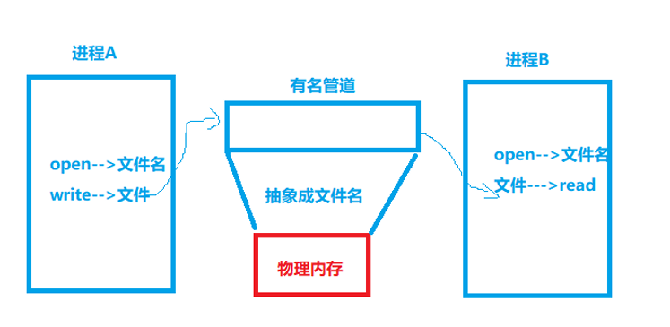

特点：

1. **半双工**，数据在同一时刻只能在一个方向上流动。 
2. 写入FIFO中的数据遵循**先入先出**的规则。 
3. FIFO所传送的数据是**无格式**的，这要求FIFO的读出方与写入方必须事先 约定好数据的格式，如多少字节算一个消息等。 
4. ==**FIFO在文件系统中作为一个特殊的文件而存在，但FIFO中的内容却存放 在内存中**==。 
5. 管道在内存中对应一个缓冲区。不同的系统其大小不一定相同。  
6. 从FIFO读数据是**一次性操作**，数据一旦被读，它就从FIFO中被抛弃，释放空间以便写更多的数据。 
7. 当使用FIFO的进程退出后，FIFO文件将继续保存在文件系统中以便以后使用。    
8. FIFO有名字，不相关的进程可以通过打开命名管道进行通信(重要、重要、重要)

### 有名管道的读写特点

==**阻塞方式**==打开管道【权限是否O_NONBLOCK】：

- open以只读方式打开FIFO时，要阻塞到某个进程为写而打开此FIFO 
- open以只写方式打开FIFO时，要阻塞到某个进程为读而打开此FIFO。 
- open以只读、只写方式打开FIFO时会阻塞，调用read函数从FIFO里读数据时read也会 阻塞。 
- 通信过程中若写进程先退出了，则调用read函数从FIFO里读数据时不阻塞；若写进程又 重新运行，则调用read函数从FIFO里读数据时又恢复阻塞。 
- 通信过程中，读进程退出后，写进程向命名管道内写数据时，写进程也会（收到 SIGPIPE信号）退出。
-  调用write函数向FIFO里写数据，当缓冲区已满时write也会阻塞。 

==**以非阻塞**==方式打开管道： 

- 先以只读方式打开：如果没有进程已经为写而打开一个FIFO, 只读open成功，并且 open不阻塞。 
- 先以只写方式打开：如果没有进程已经为读而打开一个FIFO，只写open 将出错返回-1。 
- read、write读写命名管道中读数据时不阻塞。
-  通信过程中，读进程退出后，写进程向命名管道内写数据时，写进程也会（收到 SIGPIPE信号）退出。

**注意**---open函数以可读可写方式打开FIFO文件时的特点：

- open不阻塞。  
- 调用read函数从FIFO里读数据时read会阻塞。
-  调用write函数向FIFO里写数据，当缓冲区已满时write也会阻塞

### 创建有名管道

```c
#include <sys/types.h>
#include <sys/stat.h>
int mkfifo( const char *pathname, mode_t mode);
```

- 参数： 
  - pathname：FIFO的路径名+文件名。
  -  mode：mode_t类型的权限描述符。 
- 返回值：     
  - 成功：返回 0    
  - 失败：如果文件已经存在，则会出错且返回-1

**注意**：如果有名管道出现数据异常，第一步直接删除有名管道，再重新创建一个

**fifo_write.c**

```c
#include <stdio.h>
#include <sys/types.h>
#include <sys/stat.h>
#include <fcntl.h>
#include <string.h>
#include <unistd.h>
int main(int argc, char const *argv[])
{
    // 创建有名管道
    // 注意：如果使用相对路径创建，当在其他非同一目录下的进程调用时
    // 可能会导致 路径 出错 导致找不到文件或者找错
    // 这里 测试 所以确定在同一目录下，因此使用相对路径
    mkfifo("my_fifo", 0666);
    // 运行后，磁盘上就可以看到my_fifo文件，但是实际上具体是那一块物理内存 不关心
    // 使用 ls -lh 可以看到权限描述为  prw-rw-r--，大小为0
    // p表示为管道符文件
    int fd = open("my_fifo", O_WRONLY); //会阻塞到对方以读的方式打开
    if (fd < 0)
    {
        perror("open");
        return 0;
    }

    printf("写端成功\n");
    while(1){
        char buf[128]="";
        printf("输入要发送的数据\n");
        fgets(buf,sizeof(buf),stdin);
        buf[strlen(buf)-1]=0;


        //发送数据
        write(fd,buf,strlen(buf));

        //退出循环
        if(strcmp(buf,"bye")==0){
            break;
        }
    }
    close(fd);
    return 0;
}

```

**fifo_read.c**

```c
#include <stdio.h>
#include <sys/types.h>
#include <sys/stat.h>
#include <fcntl.h>
#include <unistd.h>
#include <string.h>
int main(int argc, char const *argv[])
{
    mkfifo("my_fifo", 0666);
    int fd = open("my_fifo", O_RDONLY);
    if (fd < 0)
    {
        perror("open");
        return 0;
    }

    printf("读端成功\n");
    while (1)
    {
        char buf[128] = "";

        // 读取数据
        read(fd, buf, sizeof(buf));
        printf("读取到的数据buf=%s\n", buf);
        // 退出循环
        if (strcmp(buf, "bye") == 0)
        {
            break;
        }
    }
    close(fd);
    return 0;
}

```

### 合并写入读出

此时只需要 使用 可执行文件 

```
gcc test.c -o  _w -D writer  //生成写文件
gcc test.c -o  _r -D reader  //生成读文件
```

```c
#include <stdio.h>
#include <sys/types.h>
#include <sys/stat.h>
#include <fcntl.h>
#include <unistd.h>
#include <string.h>
int main(int argc, char const *argv[])
{
    mkfifo("my_fifo", 0666);
    int fd;
    #ifdef writer
    fd = open("my_fifo", O_WRONLY)
        #endif

        #ifdef reader
        fd = open("my_fifo", O_RDONLY);
    #endif

    if (fd < 0)
    {
        perror("open");
        return 0;
    }

    #ifdef writer
    printf("写端成功\n");
    while (1)
    {
        char buf[128] = "";
        printf("输入要发送的数据\n");
        fgets(buf, sizeof(buf), stdin);
        buf[strlen(buf) - 1] = 0;

        // 发送数据
        write(fd, buf, strlen(buf));

        // 退出循环
        if (strcmp(buf, "bye") == 0)
        {
            break;
        }
    }
    #endif

    #ifdef reader
    printf("读端成功\n");
    while (1)
    {
        char buf[128] = "";

        // 读取数据
        read(fd, buf, sizeof(buf));
        printf("读取到的数据buf=%s\n", buf);
        // 退出循环
        if (strcmp(buf, "bye") == 0)
        {
            break;
        }
    }
    #endif

    close(fd);
    return 0;
}
```

## 单机qq

```c
#include <stdio.h>
#include <sys/types.h>
#include <sys/stat.h>
#include <fcntl.h>
#include <string.h>
#include <unistd.h>
#include <sys/wait.h>
int main(int argc, char const *argv[])
{
    // 创建两个有名管道
    mkfifo("bob_to_lucy", 0666);
    mkfifo("lucy_to_bob", 0666);

    int i = 0;
    for (; i < 2; i++)
    {
        pid_t pid = fork();
        if (pid == 0)
            break;
    }

    if (i == 0) // 子进程1 负责fa消息
    {
        int fd;
        #ifdef BOB
        fd = open("bob_to_lucy", O_WRONLY);
        #endif // DEBUG
        #ifdef LUCY
        fd = open("lucy_to_bob", O_WRONLY);
        #endif // DEBUG
        if (fd < 0)
        {
            perror("open");
            _exit(-1);
        }

        // 获取键盘输入
        while (1)
        {
            // 获取键盘输入
            char buf[128] = "";
            #ifdef BOB
            printf("\rbob:");
            #endif // DEBUG
            #ifdef LUCY
            printf("\rlucy:");
            #endif // DEBUG
            fflush(stdout);
            fgets(buf, sizeof(buf), stdin);
            buf[strlen(buf) - 1] = 0;

            // 发送数据
            write(fd, buf, strlen(buf));

            // 退出循环
            if (strcmp(buf, "bye") == 0)
                break;
        }

        // 退出进程
        close(fd);
        _exit(-1);
    }
    else if (i == 1) // 子进程2 负责shou消息

    {
        int fd;
        #ifdef BOB
        fd = open("lucy_to_bob", O_RDONLY);
        #endif // DEBUG
        #ifdef LUCY
        fd = open("bob_to_lucy", O_RDONLY);
        #endif // DEBUG
        if (fd < 0)
        {
            perror("open");
            _exit(-1);
        }
        // 循环的读取数据
        while (1)
        {
            // 接收数据
            char buf[128] = "";
            read(fd, buf, sizeof(buf));
            #ifdef BOB
            printf("\rlucy:%s\n\rbob:", buf);
            #endif // DEBUG
            #ifdef LUCY
            printf("\rbob:%s\n\rlucy:", buf);
            #endif // DEBUG
            fflush(stdout);
            // 退出循环
            if (strcmp(buf, "bye") == 0)
                break;
        }
        close(fd);
        _exit(-1);
    }
    else if (i == 2) // 父进程 负责 回收资源
    {
        while (1)
        {
            pid_t pid = waitpid(-1, NULL, WNOHANG);

            if (pid < 0)
            {
                break;
            }
        }
    }

    return 0;
}
```

# 消息队列

消息队列是消息的链表，存放在**内存**中，由内核维护消息队列的特点。

1. 消息队列中的消息是**有类型**的。 
2. 消息队列中的消息是**有格式**的。 
3. 消息队列可以实现消息的**随机查询**。消息不一定要以先进先出的次序读取，编程时可以 按消息的类型读取。 
4. 消息队列**允许一个或多个进程向它写入或者读取**消息。
5. 与无名管道、命名管道一样，**从消息队列中读出消息**，消息队列中对**应的数据都会被删除**。 
6. 每个消息队列都有**消息队列标识符**，消息队列的标识符在整个系统中是唯一的。 
7. 只有内核重启或人工删除消息队列时，该消息队列才会被删除。若不人工删除消息队 列，消息队列会一直存在于系统中

**==在ubuntu 某些版本中消息队列限制值如下==**:

- 每个消息内容最多为8K字节 
- 每个消息队列容量最多为16K字节 
- 系统中消息队列个数最多为1609个 
- 系统中消息个数最多为16384个

## 获取系统唯一的key值

```c
#include <sys/types.h>
#include <sys/ipc.h>
key_t ftok(const char *pathname, int proj_id)
```

功能： 

- 获得项目相关的唯一的IPC键值。

参数： 

- pathname：路径名 
- proj_id：项目ID，非0整数(只有低8位有效) 

返回值： 

- 成功返回key值，
- 失败返回 -1

## 创建消息队列

```c
 #include <sys/msg.h>
 int msgget(key_t key, int msgflg)；
```

功能：

 创建一个新的或打开一个已经存在的消息队列。不同的进程调用此函数，只要用相同 的key值就能得到同一个消息队列的标识符。 

参数： 

key：

- IPC键值。 

- msgflg：标识函数的行为及消息队列的权限。  msgflg的取值：

  - IPC_CREAT：创建消息队列。

  - IPC_EXCL：检测消息队列是否存在。 

  - 位或权限位：消息队列位或权限位后可以设置消息队列的访问权限，格式和open函数 的mode_t一样，但可执行权限未使用。 

返回值： 

- 成功：消息队列的标识符，
- 失败：返回-1

### 查看消息队列

```c
 ipcs ‐q
```

### 删除消息队列

```c
ipcrm ‐q msqid
```

## 消息队列的信息 格式定义

```c
typedef struct _msg
{
    long mtype;  /*消息类型 必须是第一个成员 必须是long类型*/
    char mtext[100];  /*消息正文 不止一个成员*/
    ... /*消息的正文可以有多个成员*/
}MSG;
```

## 发送消息

```c
#include <sys/msg.h>
 int msgsnd(int msqid, const void *msgp,size_t msgsz, int msgflg);
```

- 功能： 
  - 将新消息添加到消息队列。
- 参数： 
  - msqid：消息队列的标识符。 
  - msgp：待发送消息结构体的地址。 
  - msgsz：消息正文的字节数。 
  - msgflg：函数的控制属性 
    - 0：msgsnd调用阻塞直到条件满足为止。 
    - IPC_NOWAIT: 若消息没有立即发送则调用该函数的进程会立即返回。 
- 返回值： 
  - 成功：0；
  - 失败：返回-1

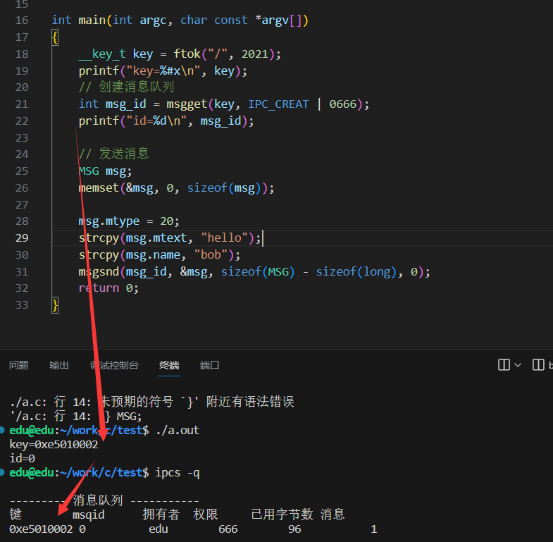

## 接收消息

```c
#include <sys/msg.h>
ssize_t msgrcv(int msqid, void *msgp, size_t msgsz, long msgtyp, int msgflg);
```

**功能**： 

- 从标识符为msqid的消息队列中接收一个消息。一旦接收消息成功，则消息在消息队 列中被删除。 

**参数**： 

- msqid：消息队列的标识符，代表要从哪个消息列中获取消息。 
- msgp： 存放消息结构体的地址。 
- msgsz：消息正文的字节数。 
- msgtyp：感兴趣消息的类型、可以有以下几种类型 
  - msgtyp = 0：返回队列中的第一个消息 
  - msgtyp > 0：返回队列中消息类型为msgtyp的消息 
  - msgtyp < 0：返回队列中消息类型值小于或等于msgtyp绝对值的消息，如果这 种消息有若干个，则取类型值最小的消息。 
  - 注意： 
    - 若消息队列中有多种类型的消息，msgrcv获取消息的时候按消息类型获取，不是先进 先出的。 
    - 在获取某类型消息的时候，若队列中有多条此类型的消息，则获取最先添加的消息， 即先进先出原 

- msgflg：函数的控制属性 
  - 0：msgrcv调用阻塞直到接收消息成功为止。 
  - MSG_NOERROR:若返回的消息字节数比nbytes字节数多,则消息就会截短到nbytes字 节,且不通知消息发送进程。 
  - IPC_NOWAIT:调用进程会立即返回。若没有收到消息则立即返回-1。 

**返回值**： 

- 成功 返回读取消息的长度，
- 失败 返回-1


发送消息：

```c
typedef struct myStruct
{
    long mtype;
    char mtext[64];
    char name[32];
} MSG;

int main(int argc, char const *argv[])
{
    __key_t key = ftok("/", 2021);
    printf("key=%#x\n", key);
    // 创建消息队列
    int msg_id = msgget(key, IPC_CREAT | 0666);
    printf("id=%d\n", msg_id);

    // 发送消息
    MSG msg;
    memset(&msg, 0, sizeof(msg));

    msg.mtype = 20;
    strcpy(msg.mtext, "hello");
    strcpy(msg.name, "bob");
    msgsnd(msg_id, &msg, sizeof(MSG) - sizeof(long), 0);
    return 0;
}
```

接收消息：

```c
typedef struct myStruct
{
    long mtype;
    char mtext[64];
    char name[32];
} MSG;

int main(int argc, char const *argv[])
{
    __key_t key = ftok("/", 2021);
    // 创建消息队列
    int msg_id = msgget(key, IPC_CREAT | 0666);

    // 接受消息
    MSG msg;
    memset(&msg, 0, sizeof(msg));

    msgrcv(msg_id, &msg, sizeof(MSG) - sizeof(long),20, 0);
    printf("发送者：%s 消息：%s",msg.name,msg.mtext);
    return 0;
}
```

## 总结

不管是发送者还是接收者

- 都要得到`ftok`得到唯一的key
- `msgget `创建消息队列

发送者:

```c
MSG msg;
msg.mtype = 接收感兴趣的类型值;
msgsnd(msg_id, &msg, sizeof(MSG) ‐ sizeof(long), 0);//发送消息到消息队列
```

接收者：

```c
MSG msg;
msgrcv(msg_id, &msg, sizeof(MSG) ‐ sizeof(long), 30, 0);
msgrcv(msg_id, &msg, sizeof(MSG) ‐ sizeof(long), 接收感兴趣的类型值, 0);
```

## 消息队列的控制

```c
#include <sys/msg.h>
int msgctl(int msqid, int cmd, struct msqid_ds *buf);
```

功能：

-   对消息队列进行各种控制，如修改消息队列的属性，或删除消息消息队列。

参数：

-  msqid：消息队列的标识符。

-  cmd：函数功能的控制。
  - IPC_RMID：删除由msqid指示的消息队列，将它从系统中删除并破坏相关数据结构。
  - IPC_STAT：将msqid相关的数据结构中各个元素的当前值存入到由buf指向的结构中。
  -  IPC_SET：将msqid相关的数据结构中的元素设置为由buf指向的结构中的对应值。
-  buf：msqid_ds数据类型的地址，用来存放或更改消息队列的属性。

返回值：

- 成功：返回 0；
- 失败：返回 ‐1

# 共享内存

## 文件内存映射

### mmap存储映射

存储映射I/O (Memory-mapped I/O) 使一个磁盘文件与存储空间中的一个缓冲区相映射。 

是当从缓冲区中取数据，就相当于读文件中的相应字节。于此类似，将数据存入缓冲区，则 相应的字节就自动写入文件

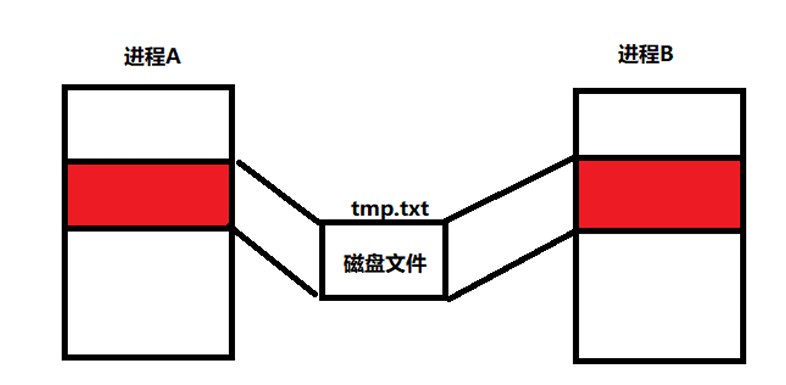

### 建立文件和内存的映射

```c
#include <sys/mman.h>

void *mmap(void *addr, size_t length, int prot, int flags,int fd, off_t offset);
```

 参数：

- addr 地址，填NULL 
- length 长度 要申请的映射区的长度 
- prot 权限 
  - PROT_READ 可读 
  - PROT_WRITE 可写 
- flags 标志位 
  - MAP_SHARED 共享的 -- 对映射区的修改会影响源文件 
  - MAP_PRIVATE 私有的 
- fd ==**文件描述符**== 需要打开一个文件
- offset 指定一个偏移位置 ，从该位置开始映射 

返回值 ：

- 成功 返回映射区的首地址 
- 失败 返回 MAP_FAILED ((void *) -1) 

### 拓展文件大小

```c
 #include <unistd.h>
 #include <sys/types.h>
 int truncate(const char *path, off_t length);
```

参数：

- path 要拓展的文件
-  length 要拓展的长度

### 释放映射区域

```c
int munmap(void *addr, size_t length);
```

参数：

- addr 映射区的首地址 
- length 映射区的长度 

返回值 ：

- 成功 返回0 
- 失败 返回 -1

**注意**：

- 只能解除本进程的映射，因为映射关系可能是多对多

### 案例

write:

```c
#include <stdio.h>
#include <sys/types.h>
#include <sys/stat.h>
#include <fcntl.h>
#include <sys/mman.h>
#include <string.h>
#include <unistd.h>
int main(int argc, char const *argv[])
{
    int fd = open("tmp", O_RDWR |  O_CREAT, 0666);
    if (fd < 0)
    {
        perror("open");
        return 0;
    }

    // 由于如果文件不存在，创建出来的文件没有内容，也就没有大小，
    // 此时想要完成映射，会因为没有大小，存放不进去
    truncate("tmp", 16);

    // 建立映射
    char *buf = (char *)mmap(NULL, 16, PROT_READ |   PROT_WRITE, MAP_SHARED, fd, 0);

    // 使用映射的区域
    strcpy(buf, "hello mmap");
    munmap(buf, 16);
    return 0;
}
```

read:

```c
#include <stdio.h>
#include <sys/types.h>
#include <sys/stat.h>
#include <fcntl.h>
#include <string.h>
#include <sys/mman.h>
#include <unistd.h>
int main(int argc, char const *argv[])
{
    int fd = open("tmp", O_RDWR |  O_CREAT, 0666);
    if (fd < 0)
    {
        perror("iopen");
        return 0;
    }

    truncate("tmp", 16);

    char *buf = (char *)mmap(NULL, 16, PROT_READ |   PROT_WRITE, MAP_SHARED, fd, 0);

    printf("%s\n", buf);   //打印hello mmap
    munmap(buf, 16);
    return 0;
}
```

## 共享内存

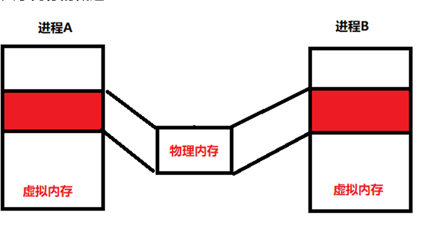

共享内存允许两个或者多个进程共享给定的存储区域。 

共享内存的特点 

- 共享内存是进程间共享数据的一种最快的方法。  一个进程向共享的内存区域写入 了数据，共享这个内存区域的所有进程就可以立刻看到其中的内容。
-  使用共享内存要注意的是多个进程之间对一个给定存储区访问的互斥。  若一个进 程正在向共享内存区写数据，则在它做完这一步操作前，别的进程不应当去读、写这些数 据

- 共享存储区的最小字节数：1 
- 共享存储区的最大字节数：32M 
- 共享存储区的最大个数：4096 
- 每个进程最多能映射的共享存储区的个数：4096

### 获得一个唯一共享存储标识符

```c
#include <sys/ipc.h>
#include <sys/shm.h>
int shmget(key_t key, size_t size,int shmflg);
```

功能:

- 创建或打开一块共享内存区 

参数：   

- key：IPC键值   
- size：该共享存储段的长度(字节)   
- shmflg：标识函数的行为及共享内存的权限。   
  - IPC_CREAT：如果不存在就创建 
  - IPC_EXCL：如果已经存在则返回失败  
  - 位或权限位：共享内存位或权限位后可以设置共享内存的访问权限，格式和 open函数的mode_t一样，但可执行权限未使用。

 返回值: 

- 成功：返回共享内存标识符。 
- 失败：返回－1

### 建立进程的虚拟内存 和 物理内存大的映射

**共享区映射**:

```c
#include <sys/types.h>
#include <sys/shm.h>
void *shmat(int shmid, const void *shmaddr,int shmflg);
```

功能：   

- 将一个共享内存段映射到调用进程的数据段中。 

参数：   

-  shmid：共享内存标识符。    
- shmaddr：共享内存映射地址(若为NULL则由系统自动指定)，**==推荐使用NULL==**。  
- shmflg：共享内存段的访问权限和映射条件  
  - 0：共享内存具有可读可写权限。  
  - SHM_RDONLY：只读。  
  - SHM_RND：（shmaddr非空时才有效）    
    - 没有指定SHM_RND则此段连接到shmaddr所指定的地址上(shmaddr必需 页对齐)。 
    - 指定了SHM_RND则此段连接到shmaddr- shmaddr%SHMLBA 所表示的 地址上。

 返回值： 

- 成功：返回共享内存段映射地址 
- 失败：返回 -1 

**注意**:

- **==shmat函数使用的时候第二个和第三个参数一般设为NULL和0==**，即系统自动指定共 享内存地址，并且共享内存可读可写

### 解除共享映射区

```c
#include <sys/types.h>
#include <sys/shm.h>
int shmdt(const void *shmaddr);
```

功能： 

- 将共享内存和当前进程分离(仅仅是断开联系并不删除共享内存)。 

参数： 

- shmaddr：共享内存映射地址。 

返回值：

-  成功返回 0，
- 失败返回 -1。

### 控制共享内存

```c
#include <sys/ipc.h>
#include <sys/shm.h>
int shmctl(int shmid, int cmd, struct shmid_ds *buf)
```

功能：

- 共享内存空间的控制。 

参数： 

- shmid：共享内存标识符。 
- cmd：函数功能的控制。 
  - IPC_RMID：删除。
  - IPC_SET：设置shmid_ds参数。 
  - IPC_STAT：保存shmid_ds参数。 
  - SHM_LOCK：锁定共享内存段(超级用户)。 
  - SHM_UNLOCK：解锁共享内存段。

- buf：shmid_ds数据类型的地址，用来存放或修改共享内存的属性。

  返回值：   

- 成功 返回 0，
- 失败 返回 -1。

write:

```c
#include <stdio.h>
#include <sys/types.h>
#include <sys/stat.h>
#include <fcntl.h>
#include <sys/mman.h>
#include <string.h>
#include <unistd.h>
#include <sys/shm.h>
#include <sys/ipc.h>
int main(int argc, char const *argv[])
{

    // 获取唯一的key值
    __key_t key = ftok("/", 2022);

    // 获取共享内存的标识（分配物理内存）
    int shm_id = shmget(key, 32, IPC_CREAT | 0666);
    
    //获取虚拟内存映射地址
    char *buf=(char *)shmat(shm_id,NULL,0);

    //操作虚拟内存
    strcpy(buf,"hello shm");

    //释放映射
    shmdt(buf);
    return 0;
}
```

read:

```c
int main(int argc, char const *argv[])
{

    // 获取唯一的key值
    __key_t key = ftok("/", 2022);

    // 获取共享内存的标识（分配物理内存）
    int shm_id = shmget(key, 32, IPC_CREAT | 0666);
    
    //获取虚拟内存映射地址
    char *buf=(char *)shmat(shm_id,NULL,0);

    //操作虚拟内存
    printf("buf=%s",buf);
    //释放映射
    shmdt(buf);
    return 0;
}
```

# 线程

## 概述

当编译线程的代码时需要加上 -lpthread

```makefile
gcc text.c -lpthread
```

在教科书中，总是把进程定义为程序的执行实例，其实它并不执行什么,只是维护应用程序所需的各种资源，而线程则是真正的执行实体。

所以，线程是轻量级的进程.，在Linux环境下线程的本质仍是进程。

为了让进程完成一定的工作进程必须至少包含一个线程。

**特点**：

- 进程 是 **系统分配资源**的基本单位 
- 线程 是 **cpu执行调度**的基本单位
- 线程 依赖于 进程，<span style="color:red">线程共享进程的资源</span>，进程结束时当前进程的所有线程 都将立即结束

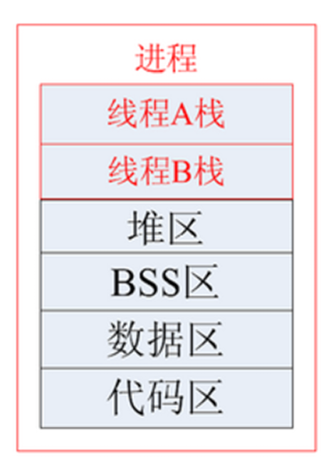

## 线程函数列表插件

```
sudo apt-get install manpages-posix-dev
```

【说明】manpages-posix-dev包盒POSIX的 header files和 library calls的用法

```
//查看
man -k pthread
```

## 线程共享与非共享资源及特点

**线程共享资源** 

1) 文件描述符表 
2) 每种信号的处理方式
3)  当前工作目录
4) 用户ID和组ID 内存地址空间 (.text/.data/.bss/heap/共享库) 

**线程非共享资源** 

1. 线程id 

2) 处理器现场和栈指针(内核栈) 
3) 独立的栈空间(用户空间栈)
4)  errno变量
5)  信号屏蔽字 
6)  调度优先级 

**线程的优缺点** 

**优点**： 

- 提高程序并发性
-  开销小 
-  数据通信、共享数据方便 

**缺点**： 

- 库函数，不稳定 
-  调试、编写困难、gdb不支持 
-  对信号支持不好 优点相对 突出，缺点均不是硬伤。Linux下由于实现方法导致进程、线程差别不是很大

## 查看线程号

```c
#include <pthread.h>
pthread_t pthread_self(void)
```

- 功能：   获取线程号。 
- 参数：   无 
- 返回值：   调用线程的线程 ID

## 创建线程

线程的类型： **pthread_t**

```c
#include <pthread.h>
int pthread_create(pthread_t *thread,const pthread_attr_t *attr,void *(*start_routine)(void *),void *arg );
```

功能：   

- 创建一个线程 

参数：   

- thread：线程标识符地址。   
- attr：线程属性结构体地址，**通常设置为 NULL**。  
-  start_routine：线程函数的入口地址。  
-  arg：传给线程函数`start_routine`的参数。 

返回值：   

- 成功：0   
- 失败：非 0

```c
#include <stdio.h>
#include <pthread.h>
#include <unistd.h>
void *pthread_fun01(void *arg)
{
    int i = 0;
    while (1)
    {
        printf("%s‐‐‐‐‐‐‐i=%d\n", (char *)arg, i++);
        sleep(1);
    }
    return NULL;
}
void *pthread_fun02(void *arg)
{
    int i = 0;
    while (1)
    {
        printf("%s‐‐‐‐‐‐‐i=%d\n", (char *)arg, i++);
        sleep(1);
    }
    return NULL;
}
int main(int argc, char *argv[])
{

    pthread_t tid1, tid2;
    pthread_create(&tid1, NULL, pthread_fun01, "任务A");
    pthread_create(&tid2, NULL, pthread_fun02, "任务B");
    return 0;
}
```

## 回收线程资源（阻塞）

pthread_join函数：带阻塞

```c
#include <pthread.h>
int pthread_join(pthread_t thread, void **retval);
```

- 功能：   
  - 等待线程结束（此函数会阻塞），并回收线程资源，类似进程的 wait() 函数。如果线程 已经结束，那么该函数会立即返回。
-  参数：  
  - thread：被等待的线程号。   
  - retval：用来存储线程退出状态的指针的地址 ，不关心返回的地址则设置为 NULL
- 返回值：   
  - 成功：0   
  - 失败：非 0

```c
void *pthread_fun01(void *arg)
{
    //.............
    return (void *)"任务A";
}
void *pthread_fun02(void *arg)
{
    //...............
    return (void *)"任务B";
}
int main(int argc, char *argv[])
{
    pthread_t tid1, tid2;
    pthread_create(&tid1, NULL, pthread_fun01, "任务A");
    pthread_create(&tid2, NULL, pthread_fun02, "任务B");


    // 回收进程资源（不关心返回值）
    pthread_join(tid1, NULL);  //这时因为带阻塞，会等待tid1线程结束，再往下执行
    pthread_join(tid2, NULL);


    void *p1 = NULL;
    // 回收进程资源（得到返回值）
    pthread_join(tid1, &p1);  
    return 0;
}
```

## pthread_detach分离线程（不阻塞）

将线程的回收工作 分离出去 线程结束时，线程由系统回收资源。使用这个以后不需要再使用pthread_join

```c
#include <pthread.h>
int pthread_detach(pthread_t thread);
```

功能： 

- 使调用线程与当前进程分离，分离后不代表此线程不依赖与当前进程，线程分离的目的 是将线程资源的回收工作交由系统自动来完成，也就是说当被分离的线程结束之后，系统会 自动回收它的资源。所以，此函数不会阻塞。 

参数：  

-  thread：线程号。 

返回值:   

- 成功：0   

- 失败：非0

## 退出线程

### 线程退出

```c
 #include <pthread.h>
  void pthread_exit(void *retval);
// 功能：
//    退出调用线程。一个进程中的多个线程是共享该进程的数      据段，因此，通常线程退出后，所占用的资源并不会释放。
//参数：
//    retval：存储线程退出状态的指针。
//返回值：无
```

```c
#include <stdio.h>
#include <pthread.h>
#include <unistd.h>
void *pthread_fun01(void *arg)
{

    int i = 0;
    while (1)
    {
        printf("%s‐‐‐‐‐‐‐i=%d\n", (char *)arg, i++);
        if (i == 5)
            //    return ;不够严谨
            pthread_exit(NULL); // 线程结束
        sleep(1);
    }

    return NULL;
}

int main(int argc, char const *argv[])
{
    // 创建两个线程
    pthread_t tid1;
    pthread_create(&tid1, NULL, pthread_fun01, "任务A");
    // 线程分离(不带阻塞)
    pthread_join(tid1, NULL);
    printf("任务A结束了\n");
    return 0;
}

```

### 线程的取消 pthread_cancel

取消自己、也可以取消当前进程的其他线程。

```c
#include <pthread.h>
int  pthread_cancel(pthread_t thread);
//功能：
//   杀死(取消)线程
//参数：
//    thread : 目标线程ID。
//返回值：
//    成功：0
//    失败：出错编号
```

- 杀死线程也不是立刻就能完成,有一定的延时性，必须要到达取消点。 
  - 取消点：是线程检查是否被取消，并 按请求进行动作的一个位置。
  - 通常是一些系统调用。

## 线程的属性

```c
typedef struct
{
    int           etachstate;   //线程的分离状态
    int           schedpolicy; //线程调度策略
    struct sched_param   schedparam;   //线程的调度参数
    int           inheritsched;    //线程的继承性
    int           scope;        //线程的作用域
    size_t        guardsize;    //线程栈末尾的警戒缓冲区大小
    int        stackaddr_set; //线程的栈设置
    void*     stackaddr;    //线程栈的位置
    size_t        stacksize;    //线程栈的大小
} pthread_attr_t;
```

### 使用线程的属性 完成线程分离

如果线程先结束 **pthread_detach**后执行  就存在问题：

```c
pthread_t tid1;
pthread_create(&tid1,NULL, pthread_fun01, "任务A");
//线程分离(不带阻塞)
pthread_detach(tid1);
```


现在可以：

- 创建线程的时候 ,通过线程属性设置线程分离，就一定保证了可以 **先分离 后执行线程**（解决了上面的问题）

1. 初始化的函数为pthread_attr_init，这个函数必须在pthread_create函数之前调用。

   - ```c
     //初始化线程属性函数：
     int pthread_attr_init(pthread_attr_t *attr); 
     // 参数：attr 线程的构造体
     // 函数返回值：成功：0；失败：错误号
     
     // 销毁线程属性所占用的资源函数：
     int pthread_attr_destroy(pthread_attr_t *attr); 
     //函数返回值：成功：0；失败：错误号
     ```

2. 线程分离状态的函数： 设置线程属性，分离or非分离

   - ```c
     int pthread_attr_setdetachstate(pthread_attr_t *attr, int detachstate);
     //参数：   
     //    attr：已初始化的线程属性  
     //    detachstate： 分离状态  
     //            PTHREAD_CREATE_DETACHED（分离线程）  
     //            PTHREAD_CREATE_JOINABLE（非分离线程）
     ```

3. 获取线程属性，分离or非分离 

   - ```c
     int pthread_attr_getdetachstate(pthread_attr_t *attr, int *detachstat);
     //参数：   
     //    attr：已初始化的线程属性  
     //    detachstate： 分离状态  
     //            PTHREAD_CREATE_DETACHED（分离线程）  
     //            PTHREAD_CREATE_JOINABLE（非分离线程）
     ```

### 设置线程分离、修改线程的栈的地址和大小

```c
#include <pthread.h>
#include <stdio.h>
#include <unistd.h>
#include <stdlib.h>
// #define SIZE 0x100000
#define SIZE 128
void *th_fun(void *arg)
{
      while (1)
            sleep(1);
}
int main(void)
{
      pthread_t tid;
      int err, detachstate, i = 1;
      pthread_attr_t attr;
      size_t stacksize;
      void *stackaddr;

      // 初始化线程属性
      pthread_attr_init(&attr);
      // 设置线程的属性值为分离状态
      pthread_attr_setdetachstate(&attr, PTHREAD_CREATE_DETACHED);
      while (1)
      {
            stackaddr = malloc(SIZE);
            if (stackaddr == NULL)
            {
                  perror("malloc");
                  exit(1);
            }
            stacksize = SIZE;
            // 将栈的地址 和栈的大小设置到线程属性值里
            pthread_attr_setstack(&attr, stackaddr, stacksize);

            // 将上面设置好的线程属性值 赋值到 创建的线程中
            err = pthread_create(&tid, &attr, th_fun, NULL);
            if (err != 0)
            {
                  printf("%s\n", strerror(err));
                  exit(1);
            }
            printf("%d\n", i++);
      }

      pthread_attr_destroy(&attr);
      return 0;
}
```

### 设置线程分离

```c
#include <pthread.h>
#include <stdio.h>
#include <unistd.h>
#include <stdlib.h>
// #define SIZE 0x100000
#define SIZE 128
void *th_fun(void *arg)
{
    while (1)
    {
        printf("任务A\n");
        sleep(1);
    }
}
int main(void)
{
    pthread_t tid;
    pthread_attr_t attr;

    // 初始化线程属性
    pthread_attr_init(&attr);
    // 设置线程的属性值为分离状态
    pthread_attr_setdetachstate(&attr, PTHREAD_CREATE_DETACHED);
    // 创建线程
    pthread_create(&tid, &attr, th_fun, NULL);
}
```


## 创建多线程

```c
#include <pthread.h>
#include <stdio.h>
#include <unistd.h>
#include <stdlib.h>
#include <string.h>
typedef struct
{
      char task_name[32];
      int time;
} MSG;

void *deal_fun(void *arg)
{
      MSG msg = *(MSG *)arg;
      int i = 0;
      for (i = msg.time; i > 0; i--)
      {
            printf("%s剩余时间%d\n", msg.task_name, i);
            sleep(1);
      }

      return NULL;
}
int main(int argc, char const *argv[])
{

      while (1)
      {
            MSG msg;
            printf("输入新增的任务名:");

            fgets(msg.task_name, sizeof(msg.task_name), stdin);
            msg.task_name[strlen(msg.task_name) - 1] = 0;

            printf("输入运行时间:");
            scanf("%d", &msg.time);
            getchar(); // 获取换行符

            pthread_t tid;
            pthread_create(&tid, NULL, deal_fun, (void *)&msg);
            pthread_detach(tid); // 线程分离
      }
      return 0;
}
```

# 多任务的同步与互斥

## 概念

**互斥**：同一时间，只能一个任务（进程或线程）执行，谁先运行不确定。 

**同步**：同一时间，只能一个任务（进程或线程）执行，有顺序的运行。==**同步 是特殊的 互斥**==。

## 互斥锁

- 读写锁和互斥锁，应用于线程的互斥。
- 互斥锁是一种简单的加锁的方法来控制对共享资源的访问。
- 互斥锁只有两种状态,即==加锁( lock )和解锁( unlock )==。
- 互斥锁的**操作流程**如下： 
  - 在访问共享资源**临界区域前**，对互斥锁进行**加锁**。 
  - 在访问完成后释放互斥锁上的锁。 （解锁） 
  - 对互斥锁进行加锁后，**任何其他试图再次对互斥锁加锁的线程将会被阻塞**，直到锁被释放。 
- 互斥锁的数据类型是： <span style="color:red">**pthread_mutex_t**</span>.

- 控制公共资源的访问，需要互斥锁，==**不管有多少个任务，只需要一把锁**==。

### 初始化互斥锁Pthread_ mutex_ init

Pthread_ mutex_ init 函数

```c
#include <pthread.h>
int pthread_mutex_init(pthread_mutex_t *mutex, const pthread_mutexattr_t *attr);
```

功能：

-  初始化一个互斥锁。

参数：

- mutex：互斥锁地址。类型是 pthread_mutex_t 。 

- attr：设置互斥量的属性，通常可采用默认属性，即可将 attr 设为 NULL。  

- ```c
  //可以使用宏 PTHREAD_MUTEX_INITIALIZER 静态初始化互斥锁，比如：
  pthread_mutex_t mutex =PTHREAD_MUTEX_INITIALIZER; 
  //这种方法等价于使用 NULL 指定的 attr 参数调用 pthread_mutex_init() 来完成动态初始化，
  //不同之处在于 PTHREAD_MUTEX_INITIALIZER 宏不进行错误检查。
  ```

返回值： 

- 成功：0，成功申请的锁默认是打开的。 
- 失败：非 0 错误码

### 销毁互斥锁

```c
#include <pthread.h>
int pthread_mutex_destroy(pthread_mutex_t *mutex)；
```

- 功能： 
  - 销毁指定的一个互斥锁。互斥锁在使用完毕后，必须要对互斥锁进行销毁，以释放资 源。 
- 参数：   
  - mutex：互斥锁地址。 
- 返回值:   
  - 成功：0   
  - 失败：非 0 错误码

### 申请上锁

```c
#include <pthread.h>
int pthread_mutex_lock(pthread_mutex_t *mutex);

int  pthread_mutex_trylock(pthread_mutex_t*mutex);
//调用该函数时，若互斥锁未加锁，则上锁，返回0；
//若互斥锁已加锁，则函数直接返回失败，即EBUSY
```

- 功能：  
  -  对互斥锁上锁，若互斥锁已经上锁，则调用者阻塞，直到互斥锁解锁后再上锁。 
- 参数：   
  - mutex：互斥锁地址。 
- 返回值：   
  - 成功：0   
  - 失败：非 0 错误码


### 解锁

```
 #include <pthread.h>
 2 int pthread_mutex_unlock(pthread_mutex_t *mutex);
```

- 功能：  
  -  对指定的互斥锁解锁。
-  参数：   
  - mutex：互斥锁地址。 
- 返回值：   
  - 成功：0   
  - 失败：非0错误码

示例：

```c

#include <stdio.h>
#include <unistd.h>
#include <stdlib.h>
#include <string.h>
#include <pthread.h>
pthread_mutex_t mutex;

void *fun1(void *arg)
{
      pthread_mutex_lock(&mutex);
      char *str = (char *)arg;
      while (*str != 0)
      {
            printf("fun1-----str=%c\n", *str++);
             sleep(1);
      }

      // 解锁
      pthread_mutex_unlock(&mutex);
}

void *fun2(void *arg)
{
      pthread_mutex_lock(&mutex);
      char *str = (char *)arg;
      while (*str != 0)
      {
            printf("fun2-----str=%c\n", *str++);
            sleep(1);
      } // 解锁
      pthread_mutex_unlock(&mutex);
}

int main(int argc, char const *argv[])
{

      // 初始化锁
      pthread_mutex_init(&mutex, NULL);

      pthread_t tid1, tid2;
      pthread_create(&tid1, NULL, fun1, "hello");
      pthread_create(&tid2, NULL, fun2, "world");

      // 回收线程资源（阻塞）
      pthread_join(tid1, NULL);
      pthread_join(tid2, NULL);

      // 销毁锁
      pthread_mutex_destroy(&mutex);
      return 0;
}

//结果：谁先抢到资源谁就执行，等到前一个执行完以后再执行下一个

//结果
// fun2-----str=w
// fun2-----str=o
// fun2-----str=r
// fun2-----str=l
// fun2-----str=d
// fun1-----str=h
// fun1-----str=e
// fun1-----str=l
// fun1-----str=l
// fun1-----str=o
```

## 死锁

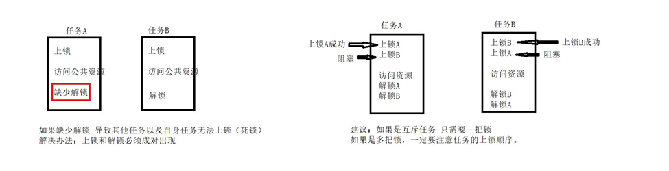

## 读写锁

### 特点

- 如果有其它线程读数据，则允许其它线程执行读操作， 但不允许写操作。 
- 如果有其它线程写数据，则其它线程都不允许读、写操 作

### 读锁和写锁的规则

- 如果某线程申请了读锁，其它线程可以再申请读锁，但不能申请写锁。
-  如果某线程申请了写锁，其它线程不能申请读锁，也不能申请写锁。

### 初始化读写锁

==读写锁的数据类型：**pthread_rwlock_t**==。

```c
#include<pthread.h>
int pthread_rwlock_init(pthread_rwlock_t *restrict rwlock, const pthread_rwlockattr_t *restrict attr);

pthread_rwlock_tmy_rwlock=PTHREAD_RWLOCK_INITIALIZER;
//这种方法等价于使用NULL指定的attr参数调用pthread_rwlock_init()来完
//成动态初始化，不同之处在于PTHREAD_RWLOCK_INITIALIZER宏不进行错误检查。
```

- 功能： 
  - 用来初始化rwlock所指向的读写锁。 
- 参数： 
  - rwlock：指向要初始化的读写锁指针。
  - attr：读写锁的属性指针。如果attr为NULL则会使用默认的属性初始化读写 锁，否则使用指定的attr初始化读写锁。 
- 返回值： 
  - 成功：0，读写锁的状态将成为已初始化和已解锁。 
  - 失败：非0错误码

### 释放读写锁

```c
#include<pthread.h>
 int pthread_rwlock_destroy(pthread_rwlock_t *rwlock);
```

- 功能： 
  - 用于销毁一个读写锁，并释放所有相关联的资源（所谓的所有指的是由pthread_rw lock_init()自动申请的资源）。 
- 参数： 
  - rwlock：读写锁指针。 
- 返回值： 
  - 成功：0 
  - 失败：非0错误码

### 申请读锁

```c
#include<pthread.h>
 int pthread_rwlock_rdlock(pthread_rwlock_t *rwlock);

int pthread_rwlock_tryrdlock(pthread_rwlock_t* rwlock);
//用于尝试以非阻塞的方式来在读写锁上获取读锁。
//如果有任何的写者持有该锁或有写者阻塞在该读写锁上，则立即失败返回
```

- 功能：
  -  以阻塞方式在读写锁上获取读锁（读锁定）。
    -  如果没有写者持有该锁，并且没有写者阻塞在该锁上，则调用线程会获取读锁。
    -  如果调用线程未获取读锁，则它将阻塞直到它获取了该锁。
    - 一个线程可以在一个读写 锁上多次执行读锁定。 
    - 线程可以成功调用**pthread_rwlock_rdlock()**函数n次，但是之后该线程必须调**pthread_rwlock_unlock()**函数n次才能解除锁定。 
- 参数： 
  - rwlock：读写锁指针。 
- 返回值： 
  - 成功：0 
  - 失败：非0错误码

### 申请写锁

```c
#include<pthread.h>
int pthread_rwlock_wrlock(pthread_rwlock_t *rwlock);

intpthread_rwlock_trywrlock(pthread_rwlock_t *rwlock);
//用于尝试以非阻塞的方式来在读写锁上获取写锁。
//如果有任何的读者或写者持有该锁，则立即失败返回。
```

- 功能：
  -  在读写锁上获取写锁（写锁定）。 如果没有写者持有该锁，并且没有写者读者持有该锁，则调用线程会获取写锁。 如果调用线程未获取写锁，则它将阻塞直到它获取了该锁。
-  参数： 
  - rwlock：读写锁指针。 
- 返回值： 
  - 成功：0 
  - 失败：非0错误码

### 释放读写锁

```c
#include<pthread.h>
int pthread_rwlock_unlock(pthread_rwlock_t *rwlock);
```

- 功能： 
  - 无论是读锁或写锁，都可以通过此函数解锁。 
- 参数：
  -  rwlock：读写锁指针。
-  返回值：
  -  成功：0 失
  - 败：非0错误码

案例：

```c

#include <stdio.h>
#include <unistd.h>
#include <stdlib.h>
#include <string.h>
#include <pthread.h>
pthread_mutex_t mutex;

// 定义一个公共资源
int num = 0;

// 定义读写锁
pthread_rwlock_t rwlock;

// 读
void *fun1(void *arg)
{

    while (1)
    {
        // 申请读锁
        pthread_rwlock_rdlock(&rwlock);
        printf("fun1-----读取num1=%d\n", num);
        sleep(1);
        // 解锁
        pthread_rwlock_unlock(&rwlock);

    }

    return NULL;
}

// 读
void *fun2(void *arg)
{

    while (1)
    {
        // 申请读锁
        pthread_rwlock_rdlock(&rwlock);
        printf("fun2-----读取num2=%d\n", num);
        sleep(1);
        // 解锁
        pthread_rwlock_unlock(&rwlock);
    }

    return NULL;
}
// 写
void *fun3(void *arg)
{

    while (1)
    {
        // 申请读锁
        pthread_rwlock_wrlock(&rwlock);
        num++;
        printf("-----------\nfun33----写入num3=%d\n----------\n", num);
        sleep(2);
        // 解锁
        pthread_rwlock_unlock(&rwlock);
    }
    return NULL;
}

int main(int argc, char const *argv[])
{

    pthread_rwlock_init(&rwlock, NULL);
    pthread_t tid1, tid2, tid3;
    pthread_create(&tid1, NULL, fun1, "hello");
    pthread_create(&tid2, NULL, fun2, "world");
    pthread_create(&tid3, NULL, fun3, "world");
    // 回收线程资源（阻塞）
    pthread_join(tid1, NULL);
    pthread_join(tid2, NULL);
    pthread_join(tid3, NULL);

    pthread_rwlock_destroy(&rwlock);
    return 0;
}

// fun2-----读取num2=0
// fun1-----读取num1=0
// fun2-----读取num2=0
// fun1-----读取num1=0
// fun1-----读取num1=0
// fun2-----读取num2=0
// fun1-----读取num1=0
// fun2-----读取num2=0
```

## 条件变量

与互斥锁不同，条件变量是用来等待而不是用来上锁的

条件变量本身不是锁！

条件变量 用来自动阻塞一个线程，直到某特殊情况发生为止。

通常条件变量和互斥锁同时使用。

**条件变量的两个动作**：

- 条件不满,阻塞线程
- 当条件满足,通知阻塞的线程开始工作。

### 条件变量的初始化

```c
#include<pthread.h>
int pthread_cond_init(pthread_cond_t *restrict cond,constpthread_condattr_t *restrict attr);


//也可以使用静态初始化的方法，初始化条件变量：
pthread_cond_t cond=PTHREAD_COND_INITIALIZER;
```

- 功能： 
  - 初始化一个条件变量 

- 参数：
  - cond：指向要初始化的条件变量指针。 
  - attr：条件变量属性，通常为默认值，传NULL即可 
- 返回值： 
  - 成功：0 
  - 失败：非0错误

### 释放条件变量

```c
#include<pthread.h>
 int pthread_cond_destroy(pthread_cond_t *cond);
```

- 功能： 
  - 销毁一个条件变量 
- 参数： 
  - cond：指向要初始化的条件变量指针
-  返回值：
  -  成功：0 
  - 失败：非0错误号


### 阻塞等待条件

```c
#include<pthread.h>
int pthread_cond_wait(pthread_cond_t *restrict cond,pthread_mutex_t *restrict mutex);
```

功能： 

- 阻塞等待一个条件变量 
  - a)阻塞等待条件变量cond（参1）满足 
  - b)释放已掌握的互斥锁（解锁互斥量）相当于**pthread_mutex_unlock(&mutex)**; 
  - a) b) 两步为一个原子操作【第a步和第b步之间不能被终端打断】。 
  - c)当被唤醒，pthread_cond_wait函数返回时，解除阻塞并重新申请获取互斥锁**pthread_mutex_lock(&mutex)**; 

参数：

-  cond：指向要初始化的条件变量指针 
- mutex：互斥锁 

返回值： 

- 成功：0 
- 失败：非0错误号

### 限时等待条件

```c
int pthread_cond_timedwait(pthread_cond_t *restrict cond, pthread_mutex_t *restrict mutex,const struct *restrict abstime);
```

功能：

-  限时等待一个条件变量 

参数： 

- cond：指向要初始化的条件变量指针 

- mutex：互斥锁 abstime：绝对时间 

返回值： 

- 成功：0 
- 失败：非0错误号

### 唤醒等待在条件变量上的线程

```c
#include<pthread.h>
int pthread_cond_signal(pthread_cond_t *cond);
```

功能： 

- 唤醒至少一个阻塞在条件变量上的线程 

参数 

- cond：指向要初始化的条件变量指 

返回值 

- 成功：0 
- 失败：非0错误

```c
int pthread_cond_broadcast(pthread_cond_t *cond);
```

功能： 

- 唤醒全部阻塞在条件变量上的线程 ，让它们自己去抢夺资源

参数： 

- cond：指向要初始化的条件变量指针 

返回值： 

- 成功：0 
- 失败：非0错误号

### 条件的变量的流程图

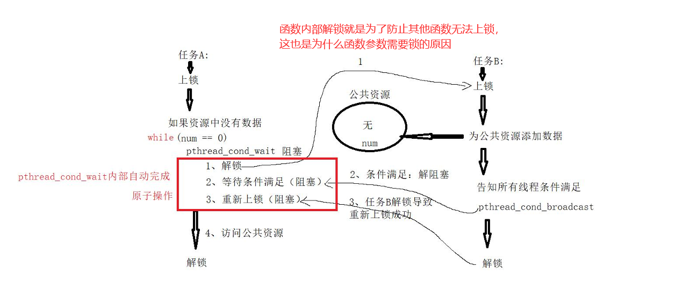

### 生产与消费者模式【案例】

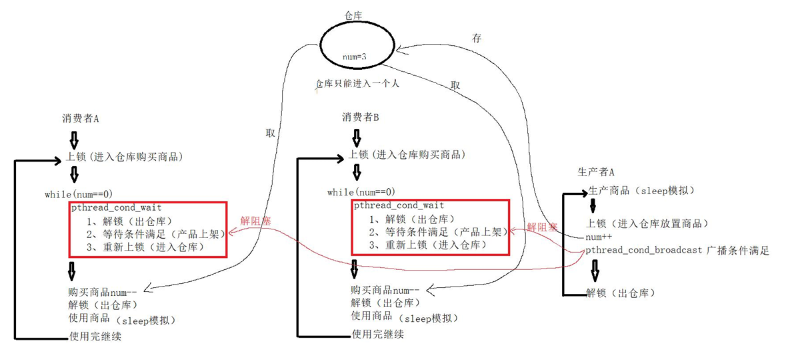

```c
#include <stdio.h>
#include <unistd.h>
#include <stdlib.h>
#include <string.h>
#include <pthread.h>
pthread_mutex_t mutex;

// 定义一个公共资源
int num = 8;

// 定义互斥锁
pthread_mutex_t mutex;

// 定义一个条件变量
pthread_cond_t cond;

// 消费
void *fun1(void *arg)
{

    while (1)
    {
        pthread_mutex_lock(&mutex);
        // 如果仓库的商品数量为0，则阻塞等待条件满足
        while (num == 0)
        {

            pthread_cond_wait(&cond, &mutex);
        }
        // 消费一个商品
        num--;
        printf("消费者%s 购买了一个商品,剩余%d\n", (char *)arg, num);

        pthread_mutex_unlock(&mutex);
        // 模拟一个商品使用时间
        sleep(2);
    }

    return NULL;
}

// 生产
void *fun3(void *arg)
{

    while (1)
    {
        sleep(3);
        pthread_mutex_lock(&mutex);
        num++;
        printf("生产者A:生产了一个商品剩余商品num=%d\n", num);
        pthread_cond_broadcast(&cond);
        pthread_mutex_unlock(&mutex);
    }
    return NULL;
}

int main(int argc, char const *argv[])
{

    pthread_mutex_init(&mutex, NULL);

    // 初始化条件变量
    pthread_cond_init(&cond, NULL);

    pthread_t tid1, tid2, tid3;
    pthread_create(&tid1, NULL, fun1, "A"); // 消费者A
    pthread_create(&tid2, NULL, fun1, "B"); // 消费者B
    pthread_create(&tid3, NULL, fun3, NULL);
    // 回收线程资源（阻塞）
    pthread_join(tid1, NULL);
    pthread_join(tid2, NULL);
    pthread_join(tid3, NULL);

    pthread_mutex_destroy(&mutex);

    // 释放条件变量
    pthread_cond_destroy(&cond);
    return 0;
}
```

## 信号量（信号灯）

信号量可以完成线程、进程的同步互斥。

### 概述

信号量本质上是一个非 负的整数计数器，它被用来控制对公共资源的访问。 

当信号量值大于0时，则可以访问，否则将阻塞。

 PV 原语是对信号量的操作，一次P操作使信号量减１，一次 V操作使信号量加1。


### 信号量的互斥

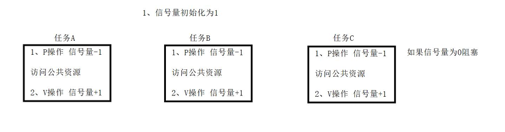

### 信号量的同步

有几个任务 就需要几个信号量。 

哪个线程先执行那么他的信号量初始化为1，其他信号量初始化为0. 

P 自己，V下一个信号量。

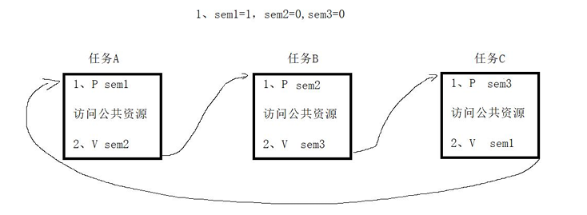

### 初始化信号量

==信号量数据类型为：**sem_t**==.

```c
#include <semaphore.h>
int sem_init(sem_t *sem, int pshared, unsigned int value)
```

功能： 

- 创建一个信号量并初始化它的值。一个无名信号量在被使用前必须先初始化。 

参数： 

- sem：信号量的地址 
- pshared：
  - 等于0，信号量在==**线程**==间共享（常用）；
  - 不等于0，信号量在==**进程**==间共享。 
- value：信号量的初始值 

返回值： 

- 成功：0 
- 失败：-1

### P操作信号量减1

```c
int sem_wait(sem_t *sem);

intsem_trywait(sem_t*sem);
//功能:尝试将信号量减一,如果信号量的值为0不阻塞,立即返回,大于0可以减一
//参数:信号量的地址
//返回值:成功返回0    失败返回 -1
```

功能:

- 如果信号量的值为0,则阻塞, 大于0可以减一 

- 将信号量减一,

参数:

- 信号量的地址 

返回值:

- 成功 返回0
- 失败  返回-1

### V操作信号量加1

```c
int sem_post(sem_t *sem);
```

功能:

- 将信号量加一

参数:

- 信号量的地址

返回值:

- 成功 返回0
- 失败 返回-1

### 销毁信号量

```c
int sem_destroy(sem_t*sem);
```

功能:

- 销毁信号量 

参数:

- 信号量的地址 

返回值:

- 成功   返回0
- 失败   返回-1

### 信号量完成线程的互斥

```c
#include <stdio.h>
#include <unistd.h>
#include <stdlib.h>
#include <string.h>
#include <pthread.h>
#include <semaphore.h>

// 定义一个公共资源
int num = 8;

sem_t sem;

void my_printf(char *str)
{
    while (*str != '\0')
    {
        printf("%c\n", *str++);
        sleep(1);
    }
}

void *fun(void *arg)
{
    sem_wait(&sem);
    my_printf((char *)arg);
    sem_post(&sem);
    return NULL;
}

int main(int argc, char const *argv[])
{

    sem_init(&sem, 0, 1);

    pthread_t tid1, tid2, tid3;
    pthread_create(&tid1, NULL, fun, "ni hao ya");
    pthread_create(&tid2, NULL, fun, "hahahahah");
    pthread_create(&tid3, NULL, fun, "who are you");
    // 回收线程资源（阻塞）
    pthread_join(tid1, NULL);
    pthread_join(tid2, NULL);
    pthread_join(tid3, NULL);

    sem_destroy(&sem);

    return 0;
}
```


### 信号量完成线程的同步

```c

#include <stdio.h>
#include <unistd.h>
#include <stdlib.h>
#include <string.h>
#include <pthread.h>
#include <semaphore.h>

// 定义一个公共资源
int num = 8;

sem_t sem1, sem2, sem3; // 有三个任务就定义三个

void my_printf(char *str)
{
    while (*str != '\0')
    {
        printf("%c\n", *str++);

        sleep(1);
    }
}

void *fun1(void *arg)
{
    sem_wait(&sem1);
    my_printf((char *)arg);
    sem_post(&sem2);
    return NULL;
}
void *fun2(void *arg)
{
    sem_wait(&sem2);
    my_printf((char *)arg);
    sem_post(&sem3);
    return NULL;
}
void *fun3(void *arg)
{
    sem_wait(&sem3);
    my_printf((char *)arg);
    sem_post(&sem1);
    return NULL;
}
int main(int argc, char const *argv[])
{

    sem_init(&sem1, 0, 1);
    sem_init(&sem2, 0, 0);
    sem_init(&sem3, 0, 0);
    pthread_t tid1, tid2, tid3;
    pthread_create(&tid1, NULL, fun1, "ni hao ya");
    pthread_create(&tid2, NULL, fun2, "hahahahah");
    pthread_create(&tid3, NULL, fun3, "who are you");
    // 回收线程资源（阻塞）
    pthread_join(tid1, NULL);
    pthread_join(tid2, NULL);
    pthread_join(tid3, NULL);

    sem_destroy(&sem1);
    sem_destroy(&sem2);
    sem_destroy(&sem3);
    return 0;
}
```

## 无名信号量

无名信号量用于有血缘的进程同步或互斥。

### 创建无名信号量

因为进程与线程不同，线程共享进程的资源，因此得以共同操作一个pv信号量

但是**进程之间资源独立**，在进程A中，pv信号量，无法直接影响到进程B的信号量，因此可以采用磁盘共享【内存映射，详见共享内存】

```c
//MAP_ANONYMOUS ：匿名映射-1 不需要文件描述符
sem_t *sem1 =  mmap(NULL, sizeof(sem_t), PROT_READ | PROT_WRITE,MAP_SHARED | MAP_ANONYMOUS,-1,0)
```

sem_init, sem_wait,sem_post，sem_destroy都是之前一样的操作

### 无名信号量用于有血缘进程的互斥

```C

#include <stdio.h>
#include <unistd.h>
#include <stdlib.h>
#include <string.h>
#include <pthread.h>
#include <semaphore.h>
#include <sys/mman.h>
#include <wait.h>
#include <sys/types.h>

void my_printf(char *str)
{
    while (*str != '\0')
    {
        printf("%c\n", *str++);

        sleep(1);
    }
}

void *fun(void *arg)
{

    my_printf((char *)arg);

    return NULL;
}

int main(int argc, char const *argv[])
{
    // 定义无名信号量
    sem_t *sem = mmap(NULL, sizeof(sem_t), PROT_READ | PROT_WRITE, MAP_SHARED | MAP_ANONYMOUS, -1, 0);
    // 初始化信号量
    sem_init(sem, 1, 1);
    pid_t pid = fork();

    if (pid == 0)
    {
        sem_wait(sem);
        fun("son");
        sem_post(sem);
    }
    else if (pid > 0)
    {
        sem_wait(sem);
        fun("father");
        sem_post(sem);
        // 等待子进程结束
        wait(NULL);
    }

    return 0;
}
```

## 有名信号量

有名信号量用于不相关的进程间的同步和互斥。

### 创建有名信号量

```C
#include<fcntl.h> /*ForO_*constants*/
#include<sys/stat.h> /*Formodeconstants*/
#include<semaphore.h>
//编译时加上-pthread
sem_t *sem_open(const char *name,int oflag);
sem_t *sem_open(const char *name,int oflag, mode_t mode,unsigned int value);
```

参数：

- name：
  - 代表的是有名信号量的名字
- oflag ：
  - O_RDONLY 只读
  -  O_WRONLY 只写
  -  O_RDWR 可读可写
  -  O_CREAT 不存在创建
  -  O_EXCL 存在报错
- mode：
  - 指的是磁盘权限0666
- value：
  - 信号量的初始值


### 关闭信号量

```c
#include<semaphore.h>
int sem_close(sem_t *sem);
```

### 删除信号量（删除的是磁盘文件）

```c
#include<unistd.h>
int unlink(const char *path);
```

### 有名信号量用于不相关的进程的互斥

test1.c

```c
#include <fcntl.h>
#include <sys/stat.h>
#include <semaphore.h>
#include <pthread.h>
#include <stdio.h>
#include <unistd.h>
void my_printf(char *str)
{
    while (*str != '\0')
    {
        printf("%c\n", *str++);
        sleep(1);
    }
}

void *fun(void *arg)
{

    my_printf((char *)arg);

    return NULL;
}

int main(int argc, char const *argv[])
{
    sem_t *sem1 = sem_open("sem1", O_RDWR | O_CREAT, 0666, 1);

    sem_wait(sem1);
    fun("aworld");
    sem_post(sem1);
    // 关闭有名信号量
    sem_close(sem1);
    // 销毁
    sem_destroy(sem1);
    return 0;
}
```

test2.c

```c
#include <fcntl.h>
#include <sys/stat.h>
#include <semaphore.h>
#include <pthread.h>
#include <stdio.h>
#include <unistd.h>
void my_printf(char *str)
{
    while (*str != '\0')
    {
        printf("%c\n", *str++);
        sleep(1);
    }
}

void *fun(void *arg)
{

    my_printf((char *)arg);

    return NULL;
}

int main(int argc, char const *argv[])
{
    sem_t *sem1 = sem_open("sem1", O_RDWR | O_CREAT, 0666, 1);

    sem_wait(sem1);
    fun("bhello");
    sem_post(sem1);
    // 关闭有名信号量
    sem_close(sem1);
    // 销毁
    sem_destroy(sem1);
    return 0;
}
```

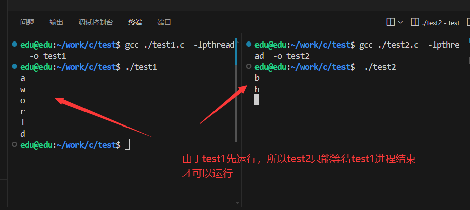


## 
